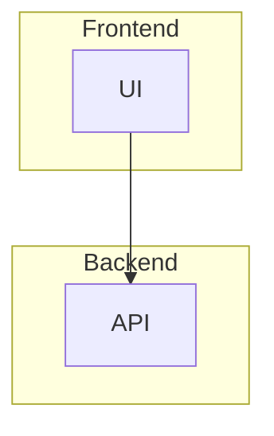
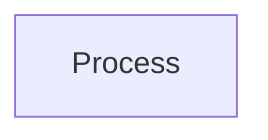

# Mermaid Diagram Specification

## Overview

Understanding Mermaid syntax, diagram types, and structure. This knowledge is essential for writing accurate linting rules and interpreting parser output.

## Learning Objectives

- [ ] Learn Mermaid diagram types (flowchart, sequence, state, er)
- [ ] Understand node and edge syntax variations
- [ ] Study diagram direction and positioning hints
- [ ] Learn subgraph syntax for clusters
- [ ] Grasp metadata and styling options

## Key Concepts

### Diagram Types

- **Flowchart (graph)**: Directed graphs, often using `graph TD` or `graph LR`
- **Sequence**: Interactions over time (`sequenceDiagram`)
- **State**: Finite state transitions (`stateDiagram-v2`)
- **Entity-Relationship**: Data modeling (`erDiagram`)

### Flowchart Syntax

- Node definitions: `NodeID[Label]`, `NodeID{Label}`, `NodeID((Label))`
- Edges: `A --> B`, `A -->|Label| B`, `A -.-> B`
- Directions: `TD`, `LR`, `RL`, `BT`

### Subgraphs

### Node/Edge Properties

- **Node ID**: Unique key, no spaces (use underscores)
- **Label**: Display text (can differ from ID)
- **Edge Types**: Solid, dashed, thick, with labels

## Relevant Code in merm8

| Component     | Location                  | Purpose                                   |
| ------------- | ------------------------- | ----------------------------------------- |
| Diagram model | internal/model/diagram.go | Nodes, edges, subgraphs                   |
| Parser        | parser-node/parse.mjs     | Mermaid AST source                        |
| Rules         | internal/rules/           | Validate structure (fanout, connectivity) |

## Development Workflow

### Parsing Flow

1. User submits diagram
2. Node.js parser builds AST
3. Go parser converts to `Diagram` model
4. Rule engine inspects nodes/edges

### Common Patterns

- **Linear Chain**: `A --> B --> C`
- **Wide Funnel**: Node fans out to many edges
- **Disconnected Node**: Node with zero edges
- **Duplicate Node ID**: Same ID used twice

## Common Tasks

### Validating Syntax

Use Mermaid parser to surface syntax errors before linting.

### Naming Nodes

### Subgraphs for Clarity

Group related nodes using `subgraph` blocks.

## Resources & Best Practices

- Official docs: https://mermaid.js.org
- Live editor: https://mermaid.live
- Always test diagrams before running rules

## Prerequisites

- Familiarity with flowcharts/diagrams
- Understanding of node/edge concepts
- Basic Mermaid syntax writing ability

## Related Skills

- Graph Theory & Algorithms for validation logic
- Node.js & JavaScript for parser implementation
