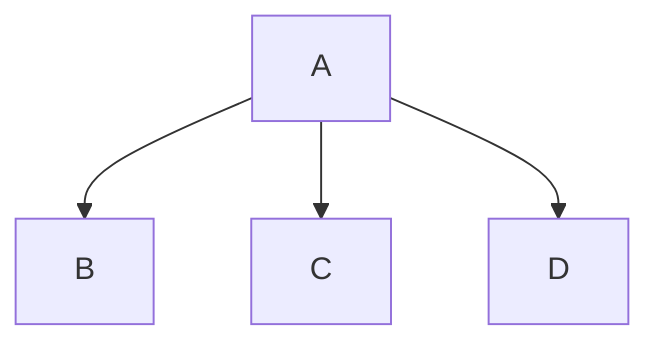

Docs available at: https://merm8-api-482194634678.europe-west1.run.app/docs
Reminder:
```bash
gcloud run deploy merm8-api-482194634678
--region=europe-west1
--image=europe-west1-docker.pkg.dev/motion-in-ocean-demo-webcam/merm8/merm8:latest
--update-env-vars MERM8_API_URL=https://merm8-api-482194634678.europe-west1.run.app
--allow-unauthenticated
```

# merm8 — mermaid-lint

A **deterministic Mermaid static analysis engine** — no AI, no LLMs, pure static analysis.

This is intended to be a Mermaid linting service that:

1. Accepts Mermaid code via HTTP POST
2. Uses official Mermaid parser (Node) to validate syntax
3. Returns structured syntax errors if invalid
4. If valid:
   - Convert parsed AST into internal Go diagram model
   - Run deterministic rule engine
   - Return structured lint results

---

## Architecture

```
┌─────────────────────────────────────────────────┐
│                  HTTP Client                    │
│          POST /analyze  (JSON body)             │
└───────────────────┬─────────────────────────────┘
                    │
                    ▼
┌─────────────────────────────────────────────────┐
│              Go HTTP API  (:8080)               │
│                                                 │
│  internal/api  ── handler.go                    │
│      │                                          │
│      ├─► internal/parser  ── parser.go          │
│      │       │  exec.CommandContext (timeout 2s)│
│      │       │  stdin ──► node parse.mjs        │
│      │       │  stdout ◄── JSON AST / error     │
│      │       ▼                                  │
│      │   parser-node/parse.mjs  (Node.js)       │
│      │   [official mermaid.parse()]              │
│      │                                          │
│      └─► internal/engine ── engine.go           │
│               │  Runs all Rule implementations  │
│               ▼                                 │
│          internal/rules/                        │
│            no_duplicate_node_ids.go             │
│            no_disconnected_nodes.go             │
│            max-fanout.go                        │
│                                                 │
│  internal/model ── diagram.go (shared types)   │
└─────────────────────────────────────────────────┘
```

---

## Quick Start

### Local (requires Go 1.24+ and Node 20+)

```bash
# Install Node parser dependencies
cd parser-node && npm install && cd ..

# Build and run the Go server
go build -o mermaid-lint ./cmd/server
PARSER_SCRIPT=./parser-node/parse.mjs ./mermaid-lint
```

### Docker

```bash
docker compose up --build
```

The service listens on **port 8080**.

## CLI (`cmd/merm8-cli`)

A first-party CLI is available for local development and CI workflows.

```bash
go build -o merm8-cli ./cmd/merm8-cli
```

### Inputs

- File paths: `./merm8-cli diagram1.mmd diagram2.mmd`
- `stdin`: `cat diagram.mmd | ./merm8-cli --stdin`
- If no files are passed, the CLI reads `stdin` by default.

### Modes

- **Local mode (default):** parses/lints in-process using the existing parser + engine (offline/CI friendly).
- **Server mode:** pass `--url` to send each input to `POST /analyze`.

```bash
cat diagram.mmd | ./merm8-cli --stdin --url http://localhost:8080
```

### Output formats

- Human-readable text (default): `--format text`
- JSON: `--format json` (shape mirrors API response fields where practical: `valid`, `diagram-type`, `lint-supported`, `syntax-error`, `issues`, `error`).

### Config passing

Pass lint rule overrides via `--config <file>`:

```bash
./merm8-cli --config ./lint-config.json ./diagram.mmd
```

Versioned config shape is supported:

```json
{
  "schema-version": "v1",
  "rules": {
    "max-fanout": { "enabled": true, "limit": 3 }
  }
}
```

### Exit codes

- `0`: success (or findings not configured to fail)
- `1`: syntax/lint findings when fail flags are enabled
- `2`: local/internal/config/input failure
- `3`: transport/server-call failure when running with `--url`

Use `--fail-on-syntax` (default `true`) and `--fail-on-lint` (default `false`) to control CI behavior.

### CI snippets

```bash
# Offline CI mode (no running API server required)
PARSER_SCRIPT=./parser-node/parse.mjs ./merm8-cli \
  --config ./lint-config.json \
  --fail-on-lint \
  diagrams/**/*.mmd
```

```bash
# Server mode CI (calls an API deployment)
./merm8-cli --url https://merm8.example.com --format json --fail-on-lint diagrams/**/*.mmd
```

---

## Canonical JSON naming convention

All API JSON field names use **kebab-case** as the canonical contract for request/response payloads and rule option keys (for example: `diagram-type`, `lint-supported`, `rule-id`, `schema-version`, `suppression-selectors`).

### Deprecation policy for legacy config keys/shapes

Canonical config format is `{"schema-version":"v1","rules":{...}}` and canonical key style is kebab-case.

- **Phase 1 (current)**: legacy snake_case keys (for example `schema_version`, `suppression_selectors`) and legacy shapes (flat `{"rule-id":{...}}` / unversioned nested `{"rules":{...}}`) are accepted **with runtime deprecation signals** (`Deprecation: true`, `Warning` header, and response `warnings`).
- **Phase 2 (v1.2.0, Q2 2026 planned)**: legacy keys/shapes will be rejected with machine-readable `400 deprecated_config_format` errors. Only canonical versioned format will be accepted.

For migration details, see [API_GUIDE.md — Configuration Format and Deprecation Policy](API_GUIDE.md#configuration-format-and-deprecation-policy).

## API

Canonical API endpoints are now versioned under `/v1` (for example: `/v1/analyze`, `/v1/rules`, `/v1/rules/schema`, `/v1/spec`, `/v1/docs`, `/v1/healthz`, `/v1/ready`).

Unversioned endpoints remain available as compatibility aliases during migration and are **deprecated**. Planned removal is **v1.2.0 (Q2 2026)**.

### `GET /v1/healthz` (canonical) and legacy aliases `GET /healthz`, `GET /health`

Liveness-only endpoints for process-up checks. `GET /healthz` is the canonical probe path, and `GET /health` is supported as an alias.

**Response**

```json
{"status":"ok"}
```

### `GET /v1/ready` (canonical) and legacy alias `GET /ready`

Dependency/readiness-only endpoint (including parser runtime/script availability when supported). This endpoint may return `503` when dependencies are not ready.

**Response (ready)**

```json
{"status":"ready"}
```

**Response (not ready)**

```json
{"status":"not_ready","error":"..."}
```

### `GET /metrics`

Prometheus-compatible metrics endpoint in text exposition format.

The server exports Prometheus metric families:
- `request_total{route,method,status}`
- `request_duration_seconds{route,method}` (histogram)
- `analyze_requests_total{outcome}`
- `parser_duration_seconds{outcome}` (histogram)

Routes are labeled consistently (for example `/analyze`, `/healthz`, `/ready`, `/metrics`) and include middleware-produced status codes such as auth/rate-limit errors.

Example scrape:

```bash
curl -s http://localhost:8080/metrics
```

Example Prometheus `scrape_configs` entry:

```yaml
scrape_configs:
  - job_name: "merm8"
    metrics_path: /metrics
    static_configs:
      - targets: ["localhost:8080"]
```


### `GET /v1/rules` (canonical) and legacy alias `GET /rules`

Live discovery endpoint for built-in lint rules and their metadata.

Returns each rule's `id`, default `severity`, description, `default-config`, and documented configurable options.

Use this endpoint to power UI/docs so runtime and documentation remain in sync.

### `GET /v1/rules/schema` (canonical) and legacy alias `GET /rules/schema`

Returns a generated JSON Schema for the `config` object accepted by `POST /analyze`.

The schema includes:
- allowed rule IDs,
- allowed options per rule (`enabled`, `severity`, `limit`, `suppression-selectors`),
- option types/constraints (e.g. `max-fanout.limit` must be an integer `>= 1`), and
- canonical versioned format only (`{"schema-version":"v1","rules": {"rule-id": {...}}}`).

You can use this endpoint so clients pre-validate config before calling `/analyze`.

A versioned schema artifact is also published at `schemas/config.v1.json` for tooling and CI workflows.

```bash
curl -s http://localhost:8080/rules/schema | jq '.schema'
```

### `POST /v1/analyze` (canonical) and legacy alias `POST /analyze`

**Request body**

```json
{
  "code": "graph TD\n  A-->B\n  B-->C",
  "config": {
    "schema-version": "v1",
    "rules": {
      "max-fanout": {
        "enabled": true,
        "severity": "error",
        "limit": 3,
        "suppression-selectors": ["node:A"]
      }
    }
  }
}
```

> `config` is optional. Canonical format is `{"schema-version":"v1","rules":{"max-fanout": {...}}}`.
>
> During Phase 1, legacy flat/nested shapes and snake_case keys are still accepted with deprecation signals (`Deprecation`/`Warning` headers and response `warnings`).
>
> Unknown rule IDs in config are rejected with machine-readable `400 unknown_rule`. Unsupported versions are rejected with `400 unsupported_schema_version` and `supported: ["v1"]`.
>
> Tip: fetch `GET /rules/schema` and validate config client-side before sending requests.

> Request body size limit: **1 MiB**. Oversized payloads return `413` with the same unified `AnalyzeResponse` shape (`valid=false`, `lint-supported=false`, `syntax-error=null`, `issues=[]`, and populated `error`).

**Response-mode matrix (`POST /analyze`)**

| HTTP status | `valid` | `syntax-error` | `issues` | `error` | when it occurs |
|---|---:|---|---|---|---|
| `200` | `true` | `null` | `[]` | `null` | Diagram parsed and linted successfully with no lint findings. |
| `200` | `true` | `null` | Non-empty array | `null` | Diagram parsed and linted successfully, and one or more lint findings were produced. |
| `200` | `false` | Populated object | `[]` | `null` | Mermaid parser reports a syntax failure. |
| Non-`200` (`400`/`413`/`429`/`500`/`503`/`504`) | `false` | `null` | `[]` | Populated object | API-level failure (invalid request, limits, parser infrastructure, timeout, etc.). |

`issues` is always present as an array (possibly empty). `syntax-error` and `error` are mutually exclusive.

- `issues[].fingerprint` is required and is a deterministic SHA-256 hash over the normalized issue signature for CI tracking and dedupe.
- `issues[].context` is optional grouping metadata for node-scoped findings; when present for subgraphs it includes `subgraph-id` and `subgraph-label`, and it is omitted when no grouping applies.

**Response — valid diagram**

```json
{
  "valid": true,
  "diagram-type": "flowchart",
  "lint-supported": true,
  "syntax-error": null,
  "issues": [],
  "metrics": {
    "node-count": 3,
    "edge-count": 2,
    "max-fanout": 1
  }
}
```

**Response — syntax error**

```json
{
  "valid": false,
  "diagram-type": "flowchart",
  "lint-supported": true,
  "syntax-error": {
    "message": "Unexpected token '>'",
    "line": 2,
    "column": 12
  },
  "issues": [],
  "metrics": {
    "node-count": 0,
    "edge-count": 0,
    "disconnected-node-count": 0,
    "duplicate-node-count": 0,
    "max-fanin": 0,
    "max-fanout": 0,
    "diagram-type": "flowchart",
    "issue-counts": {
      "by-severity": {},
      "by-rule": {}
    }
  }
}
```

**Response — unsupported diagram type (parsed but lint unsupported; metrics are still populated)**

```json
{
  "valid": false,
  "diagram-type": "sequence",
  "lint-supported": false,
  "syntax-error": null,
  "issues": [],
  "error": {
    "code": "unsupported_diagram_type",
    "message": "diagram type is parsed but linting is not supported"
  },
  "metrics": {
    "node-count": 0,
    "edge-count": 0,
    "disconnected-node-count": 0,
    "duplicate-node-count": 0,
    "max-fanin": 0,
    "max-fanout": 0,
    "diagram-type": "sequence",
    "issue-counts": {
      "by-severity": {},
      "by-rule": {}
    }
  }
}
```

**Response — successful flowchart lint**

```json
{
  "valid": true,
  "diagram-type": "flowchart",
  "lint-supported": true,
  "syntax-error": null,
  "issues": [],
  "metrics": {
    "node-count": 3,
    "edge-count": 2,
    "disconnected-node-count": 0,
    "duplicate-node-count": 0,
    "max-fanin": 1,
    "max-fanout": 1,
    "diagram-type": "flowchart",
    "direction": "TD",
    "issue-counts": {
      "by-severity": {},
      "by-rule": {}
    }
  }
}
```

### Example `curl` calls

```bash
# Valid flowchart
curl -s -X POST http://localhost:8080/analyze \
  -H "Content-Type: application/json" \
  -d '{"code": "graph TD\n  A-->B\n  B-->C"}'

# Invalid diagram
curl -s -X POST http://localhost:8080/analyze \
  -H "Content-Type: application/json" \
  -d '{"code": "this is not valid mermaid"}'

# Fan-out warning-level issue with custom limit
curl -s -X POST http://localhost:8080/analyze \
  -H "Content-Type: application/json" \
  -d '{
    "code": "graph TD\n  A-->B\n  A-->C\n  A-->D",
    "config": {"rules": {"max-fanout": {"limit": 2}}}
  }'
```

### Interactive API Documentation

**Swagger UI** is available at `http://localhost:8080/v1/docs` (legacy alias: `/docs`) when the server is running. This provides:

- Interactive API explorer with schema documentation
- "Try it out" feature to test endpoints directly
- Request/response examples for each operation
- Full OpenAPI specification browsing

**OpenAPI Specification** is available at `http://localhost:8080/v1/spec` (legacy alias: `/spec`) in JSON format, useful for code generation and API tooling integration.

**For detailed usage instructions**, see [API_GUIDE.md](API_GUIDE.md) which covers:
- How to use the Swagger UI dashboard
- Direct HTTP request examples (curl, Python, JavaScript)
- Rule configuration guide
- Integration tips and troubleshooting

---


## Security & Production Hardening

### Threat model (practical)

This service accepts untrusted Mermaid source text and executes a Node.js parser subprocess for each analysis request. The key risks are:

- **Resource exhaustion / DoS**: very large payloads, many concurrent requests, or parser-heavy inputs can consume memory and CPU.
- **Abuse of public endpoints**: anonymous users can repeatedly call `/analyze` unless guarded by authentication and rate limits.
- **Operational misconfiguration**: running without limits in production can allow a single tenant to degrade service for others.

### Built-in controls

- **Request size limit**: `/analyze` request body is capped at **1 MiB**.
- **Parser wall-clock timeout**: each parser subprocess is bounded by a Go context timeout.
- **Node heap cap**: parser subprocesses run with `--max-old-space-size=<MB>` (default `512` MB, configurable with `PARSER_MAX_OLD_SPACE_MB`).
- **Parser concurrency cap**: concurrent parser invocations are limited (default `8`, configurable with `PARSER_CONCURRENCY_LIMIT`).
- **Optional auth middleware**: in `DEPLOYMENT_MODE=production`, set `ANALYZE_AUTH_TOKEN` to require `Authorization: Bearer <token>` for `POST /analyze`.
- **Optional rate limiting middleware**: in `DEPLOYMENT_MODE=production`, requests to `POST /analyze` are rate limited per client (default `120/min`, configurable via `ANALYZE_RATE_LIMIT_PER_MINUTE`).

### Recommended production controls

At deployment time, use the built-in limits plus infrastructure-level controls:

1. Put the service behind an API gateway or ingress with TLS and additional request throttling.
2. Restrict network exposure (private VPC, firewall rules, or zero-trust proxy) where possible.
3. Run containers with explicit CPU and memory limits so parser workloads cannot starve host resources.
4. Enable structured logging and alerting on `429`, `503`, and parser timeout spikes.
5. Rotate `ANALYZE_AUTH_TOKEN` and store it in a secrets manager.

### Security-related environment variables

| Variable | Default | Purpose |
|---|---|---|
| `PARSER_MAX_OLD_SPACE_MB` | `512` | Caps Node.js V8 old-space heap for parser subprocesses. |
| `PARSER_CONCURRENCY_LIMIT` | `8` | Maximum concurrent parser invocations in the API process. |
| `DEPLOYMENT_MODE` | `development` | Enables production-oriented defaults when set to `production`. |
| `ANALYZE_RATE_LIMIT_PER_MINUTE` | `0` in development, `120` in production | Per-client fixed-window limit for `POST /analyze`. |
| `ANALYZE_AUTH_TOKEN` | _unset_ | Bearer token required by auth middleware in production when provided. |

## Rule System

Rules live in `internal/rules/` and implement the `Rule` interface:

```go
type Rule interface {
    ID()  string
    Run(d *model.Diagram, cfg Config) []model.Issue
}
```

### Built-in Rules

| Rule ID                  | Severity | Description                                          |
|--------------------------|----------|------------------------------------------------------|
| `no-duplicate-node-ids`  | error    | Each node ID must be unique within the diagram.      |
| `no-disconnected-nodes`  | error    | Every node must participate in at least one edge.    |
| `max-fanout`             | warning     | No node may have more outgoing edges than the limit. |

Severity values are canonicalized to `error`, `warning`, and `info`. The legacy `warn` value is still accepted in config and normalized to `warning`.

Default `max-fanout` limit: **5**.

### Suppressing lint issues in diagram source

The parser recognizes Mermaid line comments with `merm8` suppression tags:

- `%% merm8-disable <rule-id>` or `%% merm8-ignore <rule-id>`: suppresses that rule for the rest of the file.
- `%% merm8-disable all` or `%% merm8-ignore all`: suppresses all rules for the rest of the file.
- `%% merm8-disable-next-line <rule-id>` or `%% merm8-ignore-next-line <rule-id>`: suppresses that rule only for the next source line.
- `%% merm8-disable-next-line all` or `%% merm8-ignore-next-line all`: suppresses all rules only for the next source line.

Example:



### Adding a New Rule

1. Create `internal/rules/my_rule.go`:

```go
package rules

import "github.com/CyanAutomation/merm8/internal/model"

type MyRule struct{}

func (r MyRule) ID() string { return "my-rule" }

func (r MyRule) Run(d *model.Diagram, cfg Config) []model.Issue {
    // your logic here
    return nil
}
```

2. Register it in `internal/engine/engine.go`:

```go
rules: []rules.Rule{
    rules.NoDuplicateNodeIDs{},
    rules.NoDisconnectedNodes{},
    rules.MaxFanout{},
    rules.MyRule{},    // ← add here
},
```

That's it — no registration maps, no config files.

---

## Project Structure

```
/cmd/server          Go entry point (main.go)
/internal/api        HTTP handler (POST /analyze)
/internal/parser     Go ↔ Node subprocess bridge
/internal/model      Shared diagram types (Diagram, Node, Edge, Issue)
/internal/rules      Rule interface + built-in rule implementations
/internal/engine     Runs all registered rules against a Diagram
/parser-node         Node.js Mermaid parser script + package.json
/Dockerfile          Multi-stage Docker build
/docker-compose.yml  Local development compose file
```

---

## Testing

### Prerequisites

- **Go** 1.24+
- **Node.js** 20+ and npm
- **curl** (for smoke tests)

### Running Unit Tests

```bash
# Run all tests
go test ./...

# Run tests with coverage
go test -cover ./...

# Run tests for a specific package
go test ./internal/api/...
go test ./internal/rules/...
go test ./internal/engine/...

# Run race detector on core packages (recommended after concurrency changes)
go test -race ./internal/api ./internal/engine ./internal/parser
```

### Running Parser Integration Tests

The parser integration tests require Node.js dependencies. Install them first:

```bash
cd parser-node && npm install && cd ..
```

Then run the parser tests:

```bash
# Run parser subprocess integration tests (requires parser-node npm install)
PARSER_SCRIPT=./parser-node/parse.mjs go test ./internal/parser/...
```

Or use the environment variable to point to the parser script:

```bash
export PARSER_SCRIPT=./parser-node/parse.mjs
go test ./internal/parser/...
```

### Smoke Tests

After building and starting the service, run the smoke test script:

```bash
# Start the service first:
go build -o mermaid-lint ./cmd/server
PARSER_SCRIPT=./parser-node/parse.mjs ./mermaid-lint

# In another terminal, run smoke tests:
bash smoke-test.sh
```

The smoke test validates:
- ✅ Valid diagram parsing with correct response structure
- ✅ Syntax error handling (200 response with error details)
- ✅ Missing 'code' field rejection
- ✅ Complex diagrams with multiple nodes/edges
- ✅ Custom rule configuration application
- ✅ Graceful handling of edge cases

### Test Coverage Summary

### Testing Architecture

The test suite uses two complementary approaches:

1. **Mock-based Handler Tests**: Fast, deterministic via `ParserInterface` dependency injection
   - Mock parser returns predefined diagrams without subprocess overhead
   - Tests handler business logic in isolation
   - Implementation: `ParserInterface` interface + `mockParser` type in handler_test.go
   - Examples: `TestAnalyze_ValidDiagram_SuccessPath`, `TestAnalyze_ConfigApplied_MaxFanout`, `TestAnalyze_MultipleRulesAggregate`

2. **Integration Parser Tests**: Test real Node.js subprocess
   - Require `PARSER_SCRIPT` env var to point to parse.mjs
   - Exercise actual Mermaid parsing with official parser
   - Includes explicit coverage for timeout categorization and parser subprocess failures
   - Run with `-v` for detailed per-test output
   - Examples: `TestParser_ValidFlowchart`, `TestParser_InvalidMermaid`, `TestParser_MultipleEdges`, `TestParser_TimeoutCategory`

**Current guarantees and limitations:**
- Parser integration tests are active (not intentionally skipped) when `PARSER_SCRIPT` is configured.
- Timeout handling is validated by `TestParser_TimeoutCategory`, which uses a controlled hanging parser script.
- Results still depend on the Mermaid parser version and Node.js runtime available in the test environment.

| Component | Tests | Status |
|-----------|-------|--------|
| Rules (no-duplicate-node-ids) | ✅ | Complete |
| Rules (no-disconnected-nodes) | ✅ | Complete |
| Rules (max-fanout) | ✅ | Complete |
| Engine | ✅ | Complete |
| Handler (API) | ✅ | Enhanced |
| Parser (subprocess) | ✅ | Comprehensive |

---


## OpenAPI Spec Regeneration (Contributors)

The canonical OpenAPI source is `internal/api/openapi.go`.

Generated artifacts:
- `openapi.json`
- `openapi.yaml` (generated output; do not edit manually)

When you change API routes or schemas, regenerate both artifacts:

```bash
go run ./scripts/generate_openapi.go
```

Before opening a PR, run the sync check used by CI:

```bash
./scripts/check_openapi_generated.sh
```

Workflow summary:
1. Update `internal/api/openapi.go`.
2. Run `go run ./scripts/generate_openapi.go`.
3. Commit the updated generated files with your API change.

## Changelog

See [CHANGELOG.md](./CHANGELOG.md) for release history and notable user-visible changes.

## Contributing

See [CONTRIBUTING.md](./CONTRIBUTING.md).

## Environment Variables

| Variable        | Default                          | Description                         |
|-----------------|----------------------------------|-------------------------------------|
| `PORT`          | `8080`                           | TCP port the HTTP server listens on |
| `PARSER_SCRIPT` | `/app/parser-node/parse.mjs`     | Path to the Node.js parser script   |
| `PARSER_TIMEOUT_SECONDS` | `5`                              | Parser timeout in seconds (1–60); configurable for complex diagrams |
| `PARSER_CONCURRENCY_LIMIT` | `8`                              | Max in-flight parser subprocesses; excess requests get 503 |
| `PARSER_MAX_OLD_SPACE_MB` | `512`                            | Node.js V8 old-space heap size in MB |
| `ANALYZE_RATE_LIMIT_PER_MINUTE` | `120`                           | Rate limit for `/analyze` endpoint (0 = unlimited) |
| `DEPLOYMENT_MODE` | `development`                    | `production` or `development`; controls rate limiting and auth |
| `ANALYZE_AUTH_ENABLED` | `false`                          | Enable bearer token authentication on `/analyze` |

---

## Future Roadmap

- [~] Incrementally roll out family-specific rules for sequence/class/ER/state diagrams
- [ ] `no-cycles` rule for flowcharts
- [ ] `max-depth` rule
- [x] Per-rule suppression comments in diagram source
- [x] Configurable rule severity overrides
- [x] SARIF output format for CI integration (`POST /analyze/sarif`)
- [x] Liveness endpoints (`GET /healthz` canonical, `GET /health` alias)
- [x] Dependency readiness endpoint (`GET /ready`, returns `503` when not ready)
- [x] Metrics endpoint (Prometheus-compatible)
