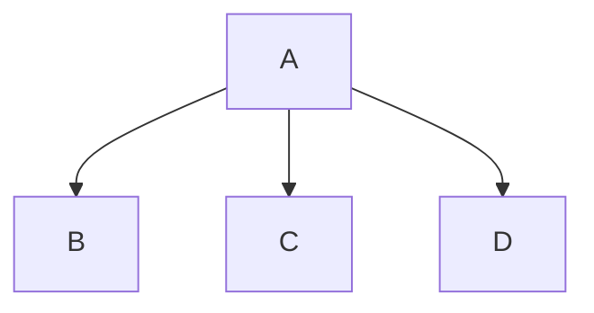

# merm8 — mermaid-lint

A **deterministic Mermaid static analysis engine** — no AI, no LLMs, pure static analysis.

This is intended to be a Mermaid linting service that:

1. Accepts Mermaid code via HTTP POST
2. Uses the official Mermaid parser in the local Go service to validate syntax
3. Returns structured syntax errors if invalid
4. If valid:
   - Convert parsed AST into internal Go diagram model
   - Run deterministic rule engine
   - Return structured lint results

---

## Architecture

```
┌─────────────────────────────────────────────────┐
│                  HTTP Client                    │
│          POST /v1/analyze  (JSON body)             │
└───────────────────┬─────────────────────────────┘
                    │
                    ▼
┌─────────────────────────────────────────────────┐
│              Go HTTP API  (:8080)               │
│                                                 │
│  internal/api  ── handler.go                    │
│      │                                          │
│      ├─► internal/parser  ── parser.go          │
│      │       │  exec.CommandContext (timeout 2s)│
│      │       │  stdin ──► node parse.mjs        │
│      │       │  stdout ◄── JSON AST / error     │
│      │       ▼                                  │
│      │   parser-node/parse.mjs  (Node.js)       │
│      │   [official mermaid.parse()]              │
│      │                                          │
│      └─► internal/engine ── engine.go           │
│               │  Runs all Rule implementations  │
│               ▼                                 │
│          internal/rules/                        │
│            no_duplicate_node_ids.go             │
│            no_disconnected_nodes.go             │
│            max-fanout.go                        │
│                                                 │
│  internal/model ── diagram.go (shared types)   │
└─────────────────────────────────────────────────┘
```

---

## Quick Start

### Local (requires Go 1.24+ and Node 20+)

```bash
# Install Node parser dependencies
cd parser-node && npm install && cd ..

# Build and run the Go server
go build -o mermaid-lint ./cmd/server
PARSER_SCRIPT=./parser-node/parse.mjs ./mermaid-lint
```

### Cloudflare Worker

The hosted REST API and MCP server run as a Cloudflare Worker. Configure the
`API_KEY` and `MCP_ALLOWED_HOSTNAMES` secrets with Wrangler, then deploy with
`npm run deploy`. REST analysis is served at `/v1/analyze`; authenticated
Streamable HTTP MCP is served at `/mcp`.

The Worker is a deliberately smaller, Worker-safe implementation. It recognizes
flowchart, sequence, class, ER, and state diagrams, and currently lints
flowcharts. Its self-describing contract is available from `/v1/spec`; use
`/v1/diagram-types` and `/v1/rules` to discover runtime capabilities. The
deployment SHA is returned in the `X-Merm8-Build` response header. See the
[Worker API reference](docs/worker-api.md) before integrating with a deployed
Worker: its contract is intentionally smaller than the local Go server API.

## CLI (`cmd/merm8-cli`)

A first-party CLI is available for local development and CI workflows.

```bash
go build -o merm8-cli ./cmd/merm8-cli
```

### Inputs

- File paths: `./merm8-cli diagram1.mmd diagram2.mmd`
- `stdin`: `cat diagram.mmd | ./merm8-cli --stdin`
- If no files are passed, the CLI reads `stdin` by default.

### Modes

- **Local mode (default):** parses/lints in-process using the existing parser + engine (offline/CI friendly).
- **Server mode:** pass `--url` to send each input to `POST /v1/analyze`.

```bash
cat diagram.mmd | ./merm8-cli --stdin --url http://localhost:8080
```

### Output formats

- Human-readable text (default): `--format text`
- JSON: `--format json` (shape mirrors API response fields where practical: `valid`, `diagram-type`, `lint-supported`, `syntax-error`, `issues`, `error`).

### Config passing

Pass lint rule overrides via `--config <file>`:

```bash
./merm8-cli --config ./lint-config.json ./diagram.mmd
```

Versioned config shape is supported:

```json
{
  "schema-version": "v1",
  "rules": {
    "max-fanout": { "enabled": true, "limit": 3 }
  }
}
```

### Exit codes

- `0`: success (or findings not configured to fail)
- `1`: syntax/lint findings when fail flags are enabled
- `2`: local/internal/config/input failure
- `3`: transport/server-call failure when running with `--url`

Use `--fail-on-syntax` (default `true`) and `--fail-on-lint` (default `false`) to control CI behavior.

### CI snippets

```bash
# Offline CI mode (no running API server required)
PARSER_SCRIPT=./parser-node/parse.mjs ./merm8-cli \
  --config ./lint-config.json \
  --fail-on-lint \
  diagrams/**/*.mmd
```

```bash
# Server mode CI (calls an API deployment)
./merm8-cli --url https://merm8.example.com --format json --fail-on-lint diagrams/**/*.mmd
```

---

## Canonical JSON naming convention

All API JSON field names use **kebab-case** as the canonical contract for request/response payloads and rule option keys (for example: `diagram-type`, `lint-supported`, `rule-id`, `schema-version`, `suppression-selectors`).

### Deprecation policy for legacy config keys/shapes

Canonical config format is `{"schema-version":"v1","rules":{...}}` and canonical key style is kebab-case.

| Legacy input                                                        | Accepted since | Warn since | Remove in                |
| ------------------------------------------------------------------- | -------------- | ---------- | ------------------------ |
| `config.schema_version`                                             | v1.0.0         | v1.0.0     | 2026-09-30               |
| Unversioned nested config (`config.rules` without `schema-version`) | v1.0.0         | v1.0.0     | 2026-12-31               |
| Flat config (`config.{rule-id}`)                                    | v1.0.0         | v1.0.0     | 2026-12-31               |
| Snake_case rule option keys (for example `suppression_selectors`)   | v1.0.0         | v1.0.0     | 2026-09-30               |

Phase-1 runtime signals include `Deprecation` + `Warning` headers, response `warnings`, and structured `meta.warnings` metadata.

For migration details, see [docs/migration-guide.md](docs/migration-guide.md) and [API_GUIDE.md — Configuration Format and Deprecation Policy](API_GUIDE.md#configuration-format-and-deprecation-policy).

## API

Canonical API endpoints are now versioned under `/v1` (for example: `/v1/analyze`, `/v1/rules`, `/v1/rules/schema`, `/v1/spec`, `/v1/docs`, `/v1/healthz`, `/v1/ready`, `/v1/version`).

### `GET /v1/healthz` (canonical)
Liveness-only endpoint for process-up checks. A `GET /v1/health` route also exists as a convenience alias on the same handler.

**Response**

```json
{ "status": "ok" }
```

### `GET /v1/ready` (canonical)

Dependency/readiness-only endpoint (including parser runtime/script availability when supported). This endpoint may return `503` when dependencies are not ready.

**Response (ready)**

```json
{ "status": "ready" }
```

**Response (not ready)**

```json
{ "status": "not_ready", "error": "..." }
```

### `GET /v1/version` (canonical)

Informational-only endpoint for app/build metadata (for example deploy version, build commit/time, parser/runtime versions). This endpoint is intentionally unauthenticated and stable for external diagnostics, but **must not** be used as a readiness signal.

**Response (example)**

```json
{
  "version": "1.2.3",
  "build-commit": "abc1234",
  "build-time": "2026-03-04T00:00:00Z",
  "parser-version": "1.0.0",
  "mermaid-version": "11.12.3"
}
```

### `GET /v1/info` (canonical)

Service capability metadata endpoint. Returns kebab-case field names as the canonical JSON contract.

**Response (example)**

```json
{
  "service-version": "1.2.3",
  "parser-version": "1.0.0",
  "mermaid-version": "11.12.3",
  "parser-timeout-seconds": 5,
  "parser-recognized": ["flowchart", "sequence", "class", "er", "state"],
  "lint-supported": ["flowchart"],
  "supported-rules": [
    "max-depth",
    "max-fanout",
    "no-cycles",
    "no-disconnected-nodes",
    "no-duplicate-node-ids"
  ]
}
```

### `GET /v1/metrics`

Prometheus-compatible metrics endpoint in text exposition format.

See [docs/metrics-observability.md](docs/metrics-observability.md) for:

- endpoint audience/access guidance for `/metrics` and `/internal/metrics`,
- full metric glossary (labels, units, cardinality notes),
- SLO-oriented alerting starters,
- Prometheus scrape/relabel recommendations, and
- a docs drift check tied to metric names.

The server exports Prometheus metric families:

- `request_total{route,method,status}`
- `request_duration_seconds{route,method}` (histogram)
- `analyze_requests_total{outcome}`
- `parser_duration_seconds{outcome}` (histogram)

Example scrape:

```bash
curl -s http://localhost:8080/v1/metrics
```

Example Prometheus `scrape_configs` entry:

```yaml
scrape_configs:
  - job_name: "merm8"
    metrics_path: /metrics
    static_configs:
      - targets: ["localhost:8080"]
```

### `GET /v1/internal/metrics`

Internal JSON counters for analyze/parser outcomes (fixed key set, no labels). Intended for internal troubleshooting and compatibility workflows.

In production, this endpoint should be restricted at network/ingress layers.

### `GET /v1/rules` (canonical)

Live discovery endpoint for enforceable lint rules and their metadata.

Returns each rule's `id`, default `severity`, description, `default-config`, and documented configurable options.

Use this endpoint to power UI/docs so runtime and documentation remain in sync.

### `GET /v1/rules/schema` (canonical)

Returns a generated JSON Schema for the `config` object accepted by `POST /v1/analyze`.

The schema includes:

- allowed rule IDs,
- allowed options per rule (`enabled`, `severity`, `limit`, `suppression-selectors`),
- option types/constraints (e.g. `max-fanout.limit` must be an integer `>= 1`), and
- canonical versioned format only (`{"schema-version":"v1","rules": {"rule-id": {...}}}`).

You can use this endpoint so clients pre-validate config before sending requests to `/v1/analyze`.

A versioned schema artifact is also published at `schemas/config.v1.json` for tooling and CI workflows.

```bash
curl -s http://localhost:8080/v1/rules/schema | jq '.schema'
```

### `GET /v1/health/metrics`
Extended health status with operational metrics.

**Response**

```json
{
  "status": "ok",
  "timestamp": 1709600000000,
  "uptime-seconds": 3600.5,
  "build-commit": "abc1234",
  "build-time": "2026-03-04T00:00:00Z",
  "parser-ready": true,
  "parser-version": "1.0.0",
  "lint-supported": ["flowchart"],
  "total-requests": 500,
  "successful-analyses": {
    "total": 480,
    "lint-success": 480
  },
  "failed-analyses": {
    "total": 20,
    "syntax-errors": 10,
    "other": 5,
    "parser-timeout": 3,
    "parser-errors": 2,
    "internal-errors": 0
  },
  "median-parser-latency-ms": 0,
  "p95-parser-latency-ms": 0
}
```

`median-parser-latency-ms` and `p95-parser-latency-ms` are currently zero; populate from histogram metrics when available.

### `GET /v1/diagram-types`
Returns parser-recognized diagram types and lint-supported diagram families.

**Response**

```json
{
  "parser-recognized": ["flowchart", "sequence", "class", "er", "state"],
  "lint-supported": ["flowchart"]
}
```

### `GET /v1/analyze/help`
Returns diagram type templates, common error patterns, arrow syntax references, and documentation links.

**Response**

```json
{
  "diagram-types": {
    "flowchart": {"description": "Directed acyclic graph for processes, workflows, and decision trees", "example": "flowchart TD\n    Start([Start]) --> Process[Do Something]\n    Process --> End([End])"},
    "sequence": {"description": "Interactions between participants over time", "example": "sequenceDiagram\n    Alice->>Bob: Hello!\n    Bob-->>Alice: Hi there!"},
    "class": {"description": "Object-oriented class hierarchy and relationships", "example": "classDiagram\n    class Animal {\n        +String name\n        +eat()\n    }"},
    "er": {"description": "Entity-relationship diagrams for data models", "example": "erDiagram\n    CUSTOMER ||--o{ ORDER : places\n    ORDER ||--|{ ITEM : contains"},
    "state": {"description": "State machines and workflows with state transitions", "example": "stateDiagram-v2\n    [*] --> Active\n    Active --> Inactive\n    Inactive --> [*]"}
  },
  "common-errors": [
    {"pattern": "No diagram type detected", "fix": "Start your diagram with a type keyword: flowchart, sequenceDiagram, classDiagram, erDiagram, or stateDiagram-v2", "example": "flowchart TD\n  A[Start] --> B[End]"},
    {"pattern": "Looks like Graphviz syntax", "fix": "Use Mermaid syntax instead. Replace 'digraph' with 'flowchart TD' and '->' with '-->'", "example": "flowchart TD\n  A --> B"},
    {"pattern": "Unexpected token", "fix": "Check syntax: correct arrow operators, bracket matching, and indentation (use spaces, not tabs)", "example": "flowchart TD\n  A[Valid Label] --> B[Another]"},
    {"pattern": "Tab indentation detected", "fix": "Replace tabs with spaces (2-4 spaces per indentation level)", "example": "flowchart TD\n    A --> B"}
  ],
  "arrow-syntax": {
    "flowchart": "-->, -..-, -.->, or ===",
    "sequence": "->, -->, ->>, ->>",
    "class": "<|--, *--, o--",
    "er": "||, |o, o|, ||"
  },
  "resources": {
    "documentation": "https://mermaid.js.org/intro/",
    "syntax-guide": "https://mermaid.js.org/syntax/flowchart.html"
  }
}
```

### `GET /v1/benchmark.html`
Serves a benchmark result HTML page at the configured path (`MERM8_BENCHMARK_HTML_PATH`, default `/app/benchmark.html`). Returns `X-Merm8-Benchmark-Status: generated` when the file exists and `X-Merm8-Benchmark-Status: placeholder` with a signature message when no pre-generated file is configured.

### `GET /v1/config-versions`
Returns config schema version compatibility information, deprecation details, and migration guidance.

**Response**

```json
{
  "current": "v1",
  "supported": ["v1"],
  "deprecations": [
    {
      "version": "unversioned",
      "status": "deprecated",
      "sunset-date": "2026-12-31T23:59:59Z",
      "replacement": "Use config.schema-version: v1 with config.rules structure",
      "migration-notes": "Legacy flat config shapes and unversioned config structures must be migrated to the v1 schema."
    },
    {
      "version": "schema_version (underscore)",
      "status": "deprecated",
      "sunset-date": "2026-09-30T23:59:59Z",
      "replacement": "Use config.schema-version (hyphenated) instead",
      "migration-notes": "The underscore variant config.schema_version is deprecated; migrate to config.schema-version."
    }
  ],
  "compatibility": {
    "api-version": "1.0",
    "accepts-accept-version": true,
    "version-negotiation": "Use Accept-Version header to request specific API versions. Response includes Content-Version header.",
    "rate-limiting": "Rate limit info available in X-RateLimit-* response headers."
  }
}
```


### `POST /v1/analyze` (canonical) with British-English alias `POST /v1/analyse`

**Request body**

```json
{
  "code": "graph TD\n  A-->B\n  B-->C",
  "config": {
    "schema-version": "v1",
    "rules": {
      "max-fanout": {
        "enabled": true,
        "severity": "error",
        "limit": 3,
        "suppression-selectors": ["node:A"]
      }
    }
  }
}
```

> `config` is optional. Canonical format is `{"schema-version":"v1","rules":{"max-fanout": {...}}}`. If `config.schema-version` is `"v1"` and `config.rules` is omitted, the server normalizes it to an empty rules object (`rules:{}`).
>
> During Phase 1, legacy flat/nested shapes and snake_case keys are still accepted with deprecation signals (`Deprecation`/`Warning` headers and response `warnings`).
>
> Unknown rule IDs in config are rejected with machine-readable `400 unknown_rule`. Unsupported versions are rejected with `400 unsupported_schema_version` and `supported: ["v1"]`.
>
> Tip: fetch `GET /v1/rules/schema` and validate config client-side before sending requests.

> Request body size limit: **1 MiB**. Oversized payloads return `413` with the same unified `AnalyzeResponse` shape (`valid=false`, `lint-supported=false`, `syntax-error=null`, `issues=[]`, and populated `error`).

**Response-mode matrix (`POST /v1/analyze`, `POST /v1/analyse`)**

> Spelling note: `analyze` is canonical. The British-English aliases `/v1/analyse` and `/v1/analyse/raw` are temporary compatibility routes and emit deprecation `Warning` headers; migrate to `/v1/analyze*`.

| HTTP status                                     | `valid` | `syntax-error`   | `issues`        | `error`          | when it occurs                                                                       |
| ----------------------------------------------- | ------: | ---------------- | --------------- | ---------------- | ------------------------------------------------------------------------------------ |
| `200`                                           |  `true` | `null`           | `[]`            | `null`           | Diagram parsed and linted successfully with no lint findings.                        |
| `200`                                           |  `true` | `null`           | Non-empty array | `null`           | Diagram parsed and linted successfully, and one or more lint findings were produced. |
| `200`                                           | `false` | Populated object | `[]`            | `null`           | Mermaid parser reports a syntax failure.                                             |
| Non-`200` (`400`/`413`/`429`/`500`/`503`/`504`) | `false` | `null`           | `[]`            | Populated object | API-level failure (invalid request, limits, parser infrastructure, timeout, etc.).   |

`issues` is always present as an array (possibly empty). `syntax-error` and `error` are mutually exclusive.

- `issues[].fingerprint` is required and is a deterministic SHA-256 hash over the normalized issue signature for CI tracking and dedupe.
- `issues[].context` is optional grouping metadata for node-scoped findings; when present for subgraphs it includes `subgraph-id` and `subgraph-label`, and it is omitted when no grouping applies.

- `request-id` is a unique request identifier for traceability.
- `timestamp` is the server timestamp (Unix milliseconds) when the analysis completed.
- `hints[]` provides structured, machine-readable syntax remediation hints with fields: `code`, `message`, `severity`, `confidence`, `applies-to` (line, column, diagram-type), and `fix-example`.
- `help-suggestion` provides structured remediation guidance with fields: `title`, `explanation`, `wrong-example`, `correct-example`, `doc-link`, and `fix-action`.
- `warnings[]` lists deprecation warnings as strings for legacy config formats or unknown rule IDs.
- `meta` contains structured warning metadata: `warnings[]` with `code`, `message`, and `replacement` per-warning info.

**Response — valid diagram**

```json
{
  "valid": true,
  "diagram-type": "flowchart",
  "lint-supported": true,
  "syntax-error": null,
  "issues": [],
  "metrics": {
    "node-count": 3,
    "edge-count": 2,
    "disconnected-node-count": 0,
    "duplicate-node-count": 0,
    "max-fanin": 1,
    "max-fanout": 1,
    "diagram-type": "flowchart",
    "direction": "TD",
    "issue-counts": {
      "by-severity": {},
      "by-rule": {}
    }
  }
}
```

**Response — syntax error**

```json
{
  "valid": false,
  "diagram-type": "flowchart",
  "lint-supported": true,
  "syntax-error": {
    "message": "Unexpected token '>'",
    "line": 2,
    "column": 12
  },
  "issues": [],
  "metrics": {
    "node-count": 0,
    "edge-count": 0,
    "disconnected-node-count": 0,
    "duplicate-node-count": 0,
    "max-fanin": 0,
    "max-fanout": 0,
    "diagram-type": "flowchart",
    "issue-counts": {
      "by-severity": {},
      "by-rule": {}
    }
  }
}
```

**Response — unsupported diagram type (parsed but lint unsupported; metrics are still populated)**

```json
{
  "valid": false,
  "diagram-type": "sequence",
  "lint-supported": false,
  "syntax-error": null,
  "issues": [],
  "error": {
    "code": "unsupported_diagram_type",
    "message": "diagram type is parsed but linting is not supported"
  },
  "metrics": {
    "node-count": 0,
    "edge-count": 0,
    "disconnected-node-count": 0,
    "duplicate-node-count": 0,
    "max-fanin": 0,
    "max-fanout": 0,
    "diagram-type": "sequence",
    "issue-counts": {
      "by-severity": {},
      "by-rule": {}
    }
  }
}
```

**Response — successful flowchart lint**

```json
{
  "valid": true,
  "diagram-type": "flowchart",
  "lint-supported": true,
  "syntax-error": null,
  "issues": [],
  "metrics": {
    "node-count": 3,
    "edge-count": 2,
    "disconnected-node-count": 0,
    "duplicate-node-count": 0,
    "max-fanin": 1,
    "max-fanout": 1,
    "diagram-type": "flowchart",
    "direction": "TD",
    "issue-counts": {
      "by-severity": {},
      "by-rule": {}
    }
  }
}
```

### Example `curl` calls

```bash
# Valid flowchart
curl -s -X POST http://localhost:8080/v1/analyze \
  -H "Content-Type: application/json" \
  -d '{"code": "graph TD\n  A-->B\n  B-->C"}'

# Invalid diagram
curl -s -X POST http://localhost:8080/v1/analyze \
  -H "Content-Type: application/json" \
  -d '{"code": "this is not valid mermaid"}'

# Fan-out warning-level issue with custom limit
curl -s -X POST http://localhost:8080/v1/analyze \
  -H "Content-Type: application/json" \
  -d '{
    "code": "graph TD\n  A-->B\n  A-->C\n  A-->D",
    "config": {"rules": {"max-fanout": {"limit": 2}}}
  }'
```

### Interactive API Documentation

**Swagger UI** is available at `http://localhost:8080/v1/docs` when the server is running. This provides:

- Interactive API explorer with schema documentation
- "Try it out" feature to test endpoints directly
- Request/response examples for each operation
- Full OpenAPI specification browsing

**OpenAPI Specification** is available at `http://localhost:8080/v1/spec` in JSON format, useful for code generation and API tooling integration.

**For detailed usage instructions**, see [API_GUIDE.md](API_GUIDE.md) which covers:

- How to use the Swagger UI dashboard
- Direct HTTP request examples (curl, Python, JavaScript)
- Rule configuration guide
- Integration tips and troubleshooting

---

### `POST /v1/analyze/raw`
Accepts raw Mermaid text (plain text or JSON). When the request body is JSON (with a `"code"` field), full config validation applies; plain text mode has no config support. The response shape mirrors `/v1/analyze`.

```bash
curl -X POST http://localhost:8080/v1/analyze/raw \
  -H "Content-Type: text/plain" \
  -d 'graph TD
  A --> B'
```

### `POST /v1/analyze/sarif`
Same request body as `/v1/analyze`; returns SARIF 2.1.0 (`application/sarif+json`) for valid analyses. Unsupported diagram types are rejected with HTTP 400.

---


## Security & Production Hardening

### Threat model (practical)

This service accepts untrusted Mermaid source text and executes a Node.js parser subprocess for each analysis request. The key risks are:

- **Resource exhaustion / DoS**: very large payloads, many concurrent requests, or parser-heavy inputs can consume memory and CPU.
- **Abuse of public endpoints**: anonymous users can repeatedly call `/v1/analyze` unless guarded by authentication and rate limits.
- **Operational misconfiguration**: running without limits in production can allow a single tenant to degrade service for others.

### Built-in controls

- **Request size limit**: `/v1/analyze` request body is capped at **1 MiB**.
- **Parser wall-clock timeout**: each parser subprocess is bounded by a Go context timeout.
- **Node heap cap**: parser subprocesses run with `--max-old-space-size=<MB>` (default `512` MB, configurable with `PARSER_MAX_OLD_SPACE_MB`).
- **Parser concurrency cap**: concurrent parser invocations are limited (default `8`, configurable with `PARSER_CONCURRENCY_LIMIT`).
- **Auth middleware**: in `DEPLOYMENT_MODE=production`, `ANALYZE_AUTH_TOKEN` is required and `POST /v1/analyze` requires `Authorization: Bearer <token>`.
- **Optional rate limiting middleware**: in `DEPLOYMENT_MODE=production`, requests to `POST /v1/analyze` are rate limited per client (default `120/min`, configurable via `ANALYZE_RATE_LIMIT_PER_MINUTE`).

### Recommended production controls

At deployment time, use the built-in limits plus infrastructure-level controls:

1. Put the service behind an API gateway or ingress with TLS and additional request throttling.
2. Restrict network exposure (private VPC, firewall rules, or zero-trust proxy) where possible.
3. Run containers with explicit CPU and memory limits so parser workloads cannot starve host resources.
4. Enable structured logging and alerting on `429`, `503`, and parser timeout spikes.
5. Rotate `ANALYZE_AUTH_TOKEN` and store it in a secrets manager.

### Health probe configuration (common platforms)

- **Liveness path:** `/v1/healthz`.
- **Readiness path:** `/v1/ready`.
- **Do not use `/v1/version` for readiness/liveness decisions**; treat it as informational only.
- **Kubernetes example:**

```yaml
livenessProbe:
  httpGet:
    path: /v1/healthz
    port: 8080
readinessProbe:
  httpGet:
    path: /v1/ready
    port: 8080
```

- **Cloudflare health checks:** point to `/v1/healthz`; `/v1/ready` remains available for application diagnostics.

### Security-related environment variables

| Variable                        | Default                                 | Purpose                                                                               |
| ------------------------------- | --------------------------------------- | ------------------------------------------------------------------------------------- |
| `PARSER_MAX_OLD_SPACE_MB`       | `512`                                   | Caps Node.js V8 old-space heap for parser subprocesses.                               |
| `PARSER_CONCURRENCY_LIMIT`      | `8`                                     | Maximum concurrent parser invocations in the API process.                             |
| `DEPLOYMENT_MODE`               | `development`                           | Enables production-oriented defaults when set to `production`.                        |
| `ANALYZE_RATE_LIMIT_PER_MINUTE` | `0` in development, `120` in production | Per-client fixed-window limit for `POST /v1/analyze`.                                    |
| `ANALYZE_AUTH_TOKEN`            | _unset_                                 | Required in production; bearer token required by auth middleware for `POST /v1/analyze`. |

## Rule System

Rules live in `internal/rules/` and implement the `Rule` interface:

```go
type Rule interface {
    ID()  string
    Run(d *model.Diagram, cfg Config) []model.Issue
}
```

### Rule ID namespace policy

Rule IDs now follow a namespace policy at registration time:

- Built-in rule IDs are returned as bare names from `GET /v1/rules` (for example `max-fanout`). Config inputs may optionally use the `core/<id>` prefix, which is normalized to the bare ID at validation time.
- External/plugin rules must use `custom/<provider>/<id>` (for example `custom/acme/max-depth-guard`).
- The `core/` prefix is reserved and rejected for non-built-in IDs.
- Unknown namespace prefixes (for example `vendor/<id>`) are rejected.

Compatibility migration for existing plugins:

- Legacy unnamespaced custom IDs (for example `acme-max-depth`) are still accepted during the transition window.
- The server logs a deprecation warning and canonicalizes those IDs as `custom/legacy/<id>` for collision detection.
- Legacy acceptance is planned to be removed in `v1.4.0`; plugin authors should migrate to `custom/<provider>/<id>`.
- See `docs/rule-id-namespaces.md` for plugin-focused examples and migration guidance.

### Built-in Rules

The following built-in rules are registered automatically via family functions (`FlowchartRules()`, `SequenceRules()`, etc.) in `internal/rules/rule_groups.go`. All implemented rules are listed below.

> **Note:** `GET /v1/rules` currently returns metadata for only 5 of these rules (the flowchart family). Metadata entries for sequence, class, ER, and state diagram rules are tracked in the rule registry but not yet surfaced by this endpoint.

| Rule ID                  | Diagram Family | Severity | Description                                                       |
| ------------------------ | -------------- | -------- | ----------------------------------------------------------------- |
| `no-duplicate-node-ids`  | flowchart      | error    | Each node ID (case-sensitive) must be unique within the diagram.  |
| `no-disconnected-nodes`  | flowchart      | error    | Every node must participate in at least one edge.                 |
| `max-fanout`             | flowchart      | warning  | No node may have more outgoing edges than the limit (default: 5). |
| `no-cycles`              | flowchart      | error    | Flags directed cycles in flowcharts.                              |
| `max-depth`              | flowchart      | warning  | Flags root-to-leaf traversals whose depth exceeds a configurable limit (default: 8). |
| `no-undefined-actors`    | sequence       | error    | Flags actor references that do not match any declared participant. |
| `no-duplicate-actors`    | sequence       | error    | Flags duplicate actor declarations in sequence diagrams.          |
| `max-nesting-depth`      | sequence       | warning  | Flags nesting depth exceeding the configured limit (default: 4).  |
| `no-circular-inheritance`| class          | error    | Flags circular inheritance chains in class diagrams.              |
| `no-duplicate-classes`   | class          | error    | Flags duplicate class declarations in class diagrams.             |
| `max-inheritance-depth`  | class          | warning  | Flags inheritance depth exceeding the configured limit (default: 4). |
| `no-circular-chain`      | er             | error    | Flags circular entity relationship chains.                        |
| `no-self-referential`    | er             | error    | Flags entities referencing themselves through relationships.      |
| `no-circular-transitions`| state          | error    | Flags circular state transitions.                                 |
| `no-unreachable-state`   | state          | error    | Flags states unreachable from any initial state.                  |
| `max-transitions`        | state          | warning  | Flags total transition count exceeding a configurable limit.      |

Severity values are canonicalized to `error`, `warning`, and `info`. The legacy `warn` value is still accepted in config and normalized to `warning`.

Default `max-fanout` limit: **5**.
Default `max-depth` limit: **8**.

### Suppressing lint issues in diagram source

The parser recognizes Mermaid line comments with `merm8` suppression tags:

- `%% merm8-disable <rule-id>` or `%% merm8-ignore <rule-id>`: suppresses that rule for the rest of the file.
- `%% merm8-disable all` or `%% merm8-ignore all`: suppresses all rules for the rest of the file.
- `%% merm8-disable-next-line <rule-id>` or `%% merm8-ignore-next-line <rule-id>`: suppresses that rule only for the next source line.
- `%% merm8-disable-next-line all` or `%% merm8-ignore-next-line all`: suppresses all rules only for the next source line.

Example:


```mermaid
graph TD
  %% merm8-disable max-fanout
  A --> B
  A --> C
  A --> D
```

### Config `suppression-selectors` grammar and evaluation

Rule config can also suppress lint issues by selector (for example `"suppression-selectors": ["node:A"]`).

Selectors are parsed with this grammar:

```ebnf
selectors      = selector , { selector } ;
selector       = [ negation ] , prefix , ":" , value ;
negation       = "!" ;
prefix         = "node" | "subgraph" | "rule" ;
value          = { escaped-char | unescaped-char } ;
escaped-char   = "\\" , any-char ;
unescaped-char = any-char - ":" ;
```

Notes:

- Parsing trims surrounding whitespace from the full selector, prefix, and value.
- Prefix matching is case-insensitive (`NoDe:A` is treated as `node:A`).
- The first unescaped `:` splits prefix/value; `\:` is a literal colon inside `value`.
- Unknown prefixes and empty values are ignored.

Evaluation for a single issue uses include/exclude matching:

- Non-negated selectors are **includes**.
- Negated selectors (`!…`) are **excludes**.
- An issue is suppressed iff **(at least one include matches) AND (no exclude matches)**.
- Selector order does not matter (set-style evaluation).

Truth-table style examples (`M+` = any include matched, `M-` = any exclude matched):

| Selectors                        |    M+ |    M- | Suppressed? | Example                                     |
| -------------------------------- | ----: | ----: | ----------: | ------------------------------------------- |
| `[]`                             | false | false |          No | nothing configured                          |
| `["rule:max-fanout"]`            |  true | false |         Yes | hide `max-fanout` issues                    |
| `["!rule:max-fanout"]`           | false |  true |          No | negation-only never suppresses              |
| `["rule:max-fanout", "!node:A"]` |  true |  true |          No | exclude overrides include                   |
| `["node:team\:alpha"]`           |  true | false |         Yes | escaped colon node ID                       |
| `["rule:unknown-rule"]`          | false | false |          No | unknown rule ID value simply does not match |

Common and edge-case examples:

- Multiple selectors combine with OR within include/exclude groups, then exclude wins globally.
- Conflicting include/exclude selectors keep issues visible when both groups match.
- Unknown rule IDs in `rule:<id>` selectors are not config errors; they just never match emitted issues.
- Malformed selectors (`"node"`, `"subgraph:"`, `"unknown:A"`) are ignored.

### Adding a New Rule

1. Create `internal/rules/my_rule.go`:

```go
package rules

import "github.com/CyanAutomation/merm8/internal/model"

type MyRule struct{}

func (r MyRule) ID() string { return "core/my-rule" }

func (r MyRule) Run(d *model.Diagram, cfg Config) []model.Issue {
    // your logic here
    return nil
}
```

2. Add it to the appropriate family function in `internal/rules/rule_groups.go`:

```go
func FlowchartRules() []Rule {
    return []Rule{
        NoDuplicateNodeIDs{},
        NoDisconnectedNodes{},
        MaxFanout{},
        NoCycles{},
        MaxDepth{},
        MyRule{},    // ← add here
    }
}
```

Rules are loaded automatically into the engine at startup via these family functions — no additional registration is needed.

---

## Project Structure

```
/cmd/server          Go entry point (main.go)
/internal/api        HTTP handler (handles /v1/* routes)
/internal/parser     Go ↔ Node subprocess bridge
/internal/model      Shared diagram types (Diagram, Node, Edge, Issue)
/internal/rules      Rule interface + built-in rule implementations
/internal/engine     Runs all registered rules against a Diagram
/parser-node         Node.js Mermaid parser script + package.json
/Dockerfile          Multi-stage Docker build
/docker-compose.yml  Local development compose file
```

---

## Testing

### Prerequisites

- **Go** 1.24+
- **Node.js** 20+ and npm
- **curl** (for smoke tests)

### Running Unit Tests

```bash
# Run all tests
go test ./...

# Run tests with coverage
go test -cover ./...

# Run tests for a specific package
go test ./internal/api/...
go test ./internal/rules/...
go test ./internal/engine/...

# Run race detector on core packages (recommended after concurrency changes)
go test -race ./internal/api ./internal/engine ./internal/parser
```

### Running Parser Integration Tests

The parser integration tests require Node.js dependencies. Install them first:

```bash
cd parser-node && npm install && cd ..
```

Then run the parser tests:

```bash
# Run parser subprocess integration tests (requires parser-node npm install)
PARSER_SCRIPT=./parser-node/parse.mjs go test ./internal/parser/...
```

Or use the environment variable to point to the parser script:

```bash
export PARSER_SCRIPT=./parser-node/parse.mjs
go test ./internal/parser/...
```

### Smoke Tests

After building and starting the service, run the smoke test script:

```bash
# Start the service first:
go build -o mermaid-lint ./cmd/server
PARSER_SCRIPT=./parser-node/parse.mjs ./mermaid-lint

# In another terminal, run smoke tests:
bash smoke-test.sh
```

The smoke test validates:

- ✅ Valid diagram parsing with correct response structure
- ✅ Syntax error handling (200 response with error details)
- ✅ Missing 'code' field rejection
- ✅ Complex diagrams with multiple nodes/edges
- ✅ Custom rule configuration application
- ✅ Graceful handling of edge cases

### Test Coverage Summary

### Testing Architecture

The test suite uses two complementary approaches:

1. **Mock-based Handler Tests**: Fast, deterministic via `ParserInterface` dependency injection
   - Mock parser returns predefined diagrams without subprocess overhead
   - Tests handler business logic in isolation
   - Implementation: `ParserInterface` interface + `mockParser` type in handler_test.go
   - Examples: `TestAnalyze_ValidDiagram_SuccessPath`, `TestAnalyze_ConfigApplied_MaxFanout`, `TestAnalyze_MultipleRulesAggregate`

2. **Integration Parser Tests**: Test real Node.js subprocess
   - Require `PARSER_SCRIPT` env var to point to parse.mjs
   - Exercise actual Mermaid parsing with official parser
   - Includes explicit coverage for timeout categorization and parser subprocess failures
   - Run with `-v` for detailed per-test output
   - Examples: `TestParser_ValidFlowchart`, `TestParser_InvalidMermaid`, `TestParser_MultipleEdges`, `TestParser_TimeoutCategory`

**Current guarantees and limitations:**

- Parser integration tests are active (not intentionally skipped) when `PARSER_SCRIPT` is configured.
- Timeout handling is validated by `TestParser_TimeoutCategory`, which uses a controlled hanging parser script.
- Results still depend on the Mermaid parser version and Node.js runtime available in the test environment.

| Component                     | Tests | Status        |
| ----------------------------- | ----- | ------------- |
| Rules (no-duplicate-node-ids) | ✅    | Complete      |
| Rules (no-disconnected-nodes) | ✅    | Complete      |
| Rules (max-fanout)            | ✅    | Complete      |
| Engine                        | ✅    | Complete      |
| Handler (API)                 | ✅    | Enhanced      |
| Parser (subprocess)           | ✅    | Comprehensive |

---

## OpenAPI Spec Regeneration (Contributors)

The canonical OpenAPI source is `internal/api/openapi.go`.

Generated artifacts:

- `openapi.json`
- `openapi.yaml` (generated output; do not edit manually)

When you change API routes or schemas, regenerate both artifacts:

```bash
go run ./scripts/generate_openapi.go
```

Before opening a PR, run the sync check used by CI:

```bash
./scripts/check_openapi_generated.sh
```

Workflow summary:

1. Update `internal/api/openapi.go`.
2. Run `go run ./scripts/generate_openapi.go`.
3. Commit the updated generated files with your API change.

## Changelog

See [CHANGELOG.md](./CHANGELOG.md) for release history and notable user-visible changes.

## Contributing

See [CONTRIBUTING.md](./CONTRIBUTING.md).

## Environment Variables

| Variable                        | Default                                       | Description                                                                                                         |
| ------------------------------- | --------------------------------------------- | ------------------------------------------------------------------------------------------------------------------- |
| `PORT`                          | `8080`                                        | TCP port the HTTP server listens on                                                                                 |
| `PARSER_SCRIPT`                 | `/app/parser-node/parse.mjs`                  | Path to the Node.js parser script                                                                                   |
| `PARSER_TIMEOUT_SECONDS`        | `5`                                           | Parser wall-clock timeout in seconds (1-60); configurable for complex diagrams                                      |
| `PARSER_CONCURRENCY_LIMIT`      | `8`                                           | Maximum concurrent parser invocations; excess requests receive 503                                                  |
| `PARSER_MAX_OLD_SPACE_MB`       | `512`                                         | Node.js V8 old-space heap cap per parser subprocess                                                                 |
| `PARSER_MODE`                  | `pool`                                      | Parser execution mode. `pool` reuses long-lived Node workers; set `subprocess` for one-parse-per-process behavior.      |
| `PARSER_WORKER_POOL_SIZE`       | `4`                                         | Maximum number of long-lived parser workers when PARSER_MODE=pool (bounded to 1-64).                                   |
| `PARSER_SOURCE_ENHANCEMENT`     | `true`                                      | Enables source-level AST enhancement for flowchart rules. Set `false` to disable.                                       |
| `DEPLOYMENT_MODE`               | `development`                                 | `production` enables production-oriented defaults for rate limiting and auth                                        |
| `ANALYZE_RATE_LIMIT_PER_MINUTE` | `120` in production, `0` otherwise            | Per-client rate limit for `POST /v1/analyze` (0 disables rate limiting)                                             |
| `ANALYZE_AUTH_TOKEN`            | _unset_                                       | Bearer token required in production mode for `POST /v1/analyze` requests                                            |
| `ALLOWED_ORIGINS`               | `https://merm8-splash.vercel.app`             | CORS allowed origins header value; defaults to https://merm8-splash.vercel.app when unset                            |
| `STRICT_CONFIG_SCHEMA`          | _unset_ (`false`)                             | When set to `true` or `1`, rejects legacy config formats instead of accepting with deprecation warnings              |
| `MERM8_BENCHMARK_HTML_PATH`     | `/app/benchmark.html`                         | Filepath for the benchmark result HTML page served at `GET /v1/benchmark.html`                                      |
| `ANALYZE_TRUSTED_PROXY_CIDRS`   | _unset_                                       | Comma-separated list of CIDRs/IPs whose traffic is trusted for client IP via `X-Forwarded-For`                       |
---

## Future Roadmap

- [~] Incrementally roll out family-specific rules for sequence/class/ER/state diagrams
- [x] `no-cycles` rule for flowcharts
- [x] `max-depth` rule
- [x] Per-rule suppression comments in diagram source
- [x] Configurable rule severity overrides
- [x] SARIF output format for CI integration (`POST /v1/analyze/sarif`)
- [x] Liveness endpoints (`GET /v1/healthz` canonical, `GET /v1/health` alias)
- [x] Dependency readiness endpoint (`GET /v1/ready`, returns `503` when not ready)
- [x] Metrics endpoint (Prometheus-compatible)
