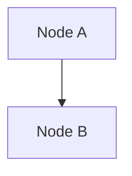

# merm8 Benchmark Suite

The merm8 benchmark suite provides a comprehensive framework for evaluating the efficacy of mermaid code linting rules. Similar to LLM benchmarks (FrontierScience, GDPval, HealthBench), the merm8 benchmark suite rigorously tests rule implementations against a curated dataset of real-world and synthetic mermaid diagrams.

## Overview

The benchmark system:

- **Discovers test cases** by scanning `benchmarks/cases/` for `.mmd` fixture files
- **Automatically generates case metadata** from fixture annotations and directory structure
- **Executes all cases** using the merm8 parser and rule engine
- **Aggregates metrics** by rule: detection rate, false positives, timing
- **Generates HTML and JSON reports** for easy visualization and CI integration
- **Compares against baselines** to detect regressions in rule efficacy
- **Supports filtering** by rule, category, and diagram type

## Quick Start

### Run All Benchmarks

```bash
go run ./benchmarks/main.go
```

This will:

1. Discover all `.mmd` test cases
2. Execute the benchmark suite
3. Generate `benchmark.html` (HTML report) and `benchmarks/reports/latest-results.json` (JSON results)
4. Print a text summary to stdout

### Run Specific Rule

```bash
go run ./benchmarks/main.go -rule no-cycles
```

### Filter by Category

```bash
# Run only violation test cases
go run ./benchmarks/main.go -category violation

# Run only valid diagram cases
go run ./benchmarks/main.go -category valid
```

### Compare Against Baseline

```bash
go run ./benchmarks/main.go -compare-baseline benchmarks/baselines/v0.1.0.json
```

This will print regression alerts if detection rate drops >5% per rule.

### Verbose Output

```bash
go run ./benchmarks/main.go -verbose
```

### Using Makefile

```bash
make benchmark
```

## Directory Structure

```
benchmarks/
├── cases.go                          # Type definitions
├── runner.go                         # Runner logic and HTML template
├── runner_test.go                    # Runner tests
├── main.go                           # CLI entry point
├── BENCHMARK.md                      # This file
├── CONTRIBUTING.md                   # How to add test cases
├── cases/
│   ├── flowchart/
│   │   ├── valid/                    # Valid diagrams (should pass linting)
│   │   │   ├── simple-linear.mmd
│   │   │   ├── branched-flow.mmd
│   │   │   ├── complex-flow.mmd
│   │   │   ├── long-linear-chain.mmd
│   │   │   └── parallel-paths.mmd
│   │   ├── violations/               # Diagrams with known violations
│   │   │   ├── simple-cycle.mmd
│   │   │   ├── self-loop.mmd
│   │   │   ├── complex-cycle.mmd
│   │   │   ├── duplicate-nodes.mmd
│   │   │   ├── triple-duplicate.mmd
│   │   │   ├── disconnected-node.mmd
│   │   │   ├── fully-connected.mmd
│   │   │   ├── two-isolated.mmd
│   │   │   ├── high-fanout.mmd
│   │   │   ├── max-fanout-over-limit.mmd
│   │   │   ├── deep-tree.mmd
│   │   │   └── max-depth-over-limit.mmd
│   │   └── edge-cases/               # Boundary conditions
│   │       ├── single-node.mmd
│   │       ├── fanout-at-limit.mmd
│   │       ├── max-fanout-under-limit.mmd
│   │       ├── max-depth-at-limit.mmd
│   │       └── max-depth-under-limit.mmd
│   ├── sequence/
│   │   ├── valid/                    # Valid sequence diagrams
│   │   │   ├── simple-interaction.mmd
│   │   │   ├── three-actor-interaction.mmd
│   │   │   ├── five-actor-flow.mmd
│   │   │   ├── loop-and-alt.mmd
│   │   │   ├── microservice-call.mmd
│   │   │   ├── nested-async-flow.mmd
│   │   │   ├── parallel-processing.mmd
│   │   │   ├── pubsub-pattern.mmd
│   │   │   └── request-response-flow.mmd
│   │   ├── violations/
│   │   │   ├── undefined-actor-reference.mmd
│   │   │   ├── duplicate-actor.mmd
│   │   │   ├── duplicate-actor-alias.mmd
│   │   │   ├── deep-nesting.mmd
│   │   │   └── high-message-count.mmd
│   │   └── edge-cases/
│   │       ├── self-message.mmd
│   │       ├── single-actor-no-messages.mmd
│   │       └── with-notes.mmd
│   ├── class/
│   │   ├── valid/                    # Valid class diagrams
│   │   │   ├── simple-inheritance.mmd
│   │   │   ├── multi-inheritance.mmd
│   │   │   ├── complex-hierarchy.mmd
│   │   │   ├── composition.mmd
│   │   │   ├── interface-implementation.mmd
│   │   │   ├── organization-structure.mmd
│   │   │   └── single-class.mmd
│   │   ├── violations/
│   │   │   ├── circular-inheritance.mmd
│   │   │   ├── duplicate-class.mmd
│   │   │   └── deep-inheritance.mmd
│   │   └── edge-cases/
│   │       ├── empty-class.mmd
│   │       └── many-members.mmd
│   ├── er/
│   │   ├── valid/                    # Valid ER diagrams
│   │   │   ├── blog-schema.mmd
│   │   │   ├── company-structure.mmd
│   │   │   ├── ecommerce-schema.mmd
│   │   │   ├── library-system.mmd
│   │   │   └── university-system.mmd
│   │   ├── violations/
│   │   │   ├── circular-chain.mmd
│   │   │   ├── circular-self-reference.mmd
│   │   │   └── self-referential.mmd
│   │   └── edge-cases/
│   │       ├── many-relationships.mmd
│   │       └── single-entity.mmd
│   └── state/
│       ├── valid/                    # Valid state diagrams
│       │   ├── simple-state-machine.mmd
│       │   ├── connection-lifecycle.mmd
│       │   ├── device-states.mmd
│       │   ├── order-workflow.mmd
│       │   └── task-lifecycle.mmd
│       ├── violations/
│       │   ├── circular-transitions.mmd
│       │   ├── unreachable-state.mmd
│       │   ├── high-complexity.mmd
│       │   └── nested-states.mmd
│       └── edge-cases/
│           └── single-state.mmd
├── baselines/
│   └── v0.1.0.json                   # v0.1.0 baseline results
└── reports/
    ├── index.html                    # Latest HTML report
    └── latest-results.json           # Latest JSON results
```

## Test Case Format

Test cases are `.mmd` files with optional metadata annotations. Annotations are single-line Mermaid comments:



### Metadata Annotations

- `%% @rule: no-cycles` — Specifies which rule this case tests. Use `%% @rule: *` for cases testing all rules.
- `%% @severity: error|warning|info` — Optional: expected severity (if multiple rules apply)

### Case Categories

Cases are organized by category:

- **`valid/`** — Diagrams that should NOT trigger rule violations
- **`violations/`** — Diagrams with known violations; runner expects issues
- **`edge-cases/`** — Boundary conditions and corner cases

### Discovery and Metadata Generation

The runner **auto-discovers** cases by:

1. Walking `benchmarks/cases/{diagramType}/{category}/`
2. Finding all `.mmd` files
3. Extracting `@rule` annotations from comments
4. Generating a `BenchmarkCase` struct for each file with:
   - `ID`: Auto-generated from filename
   - `DiagramPath`: Relative path to fixture
   - `RuleID`: Extracted from `@rule` annotation (defaults to `*`)
   - `Category`: Derived from directory (valid/violations/edge-cases)
   - `DiagramType`: flowchart, sequence, class, er, state

**No manual `cases.json` file is required** — the runner generates metadata on-the-fly.

## Metrics

### Per-Rule Metrics

For each rule, the benchmark system tracks:

| Metric                  | Description                           |
| ----------------------- | ------------------------------------- |
| **Total Cases**         | Number of test cases for the rule     |
| **Passed**              | Number of cases with correct results  |
| **Detection Rate**      | `Passed / Total Cases` (0–1)          |
| **False Positives**     | Issues reported that weren't expected |
| **False Positive Rate** | `FalsePositives / TotalActualIssues`  |
| **Avg Parse Time**      | Average milliseconds to parse case    |
| **Avg Lint Time**       | Average milliseconds to execute rule  |

### Regression Detection

When `--compare-baseline` is used, the runner compares current metrics against a baseline. A **regression alert** is triggered when:

```
(BaselineDetectionRate - CurrentDetectionRate) * 100 > threshold%
```

Default threshold: 5% (configurable via `--regression-threshold`).

## Reports

> Note: The canonical user-facing HTML report path is now `benchmark.html`. A legacy copy may still be emitted at `benchmarks/reports/index.html` temporarily for backward compatibility.

### HTML Report

The HTML report (`benchmark.html`) displays:

- Overall pass rate and summary metrics
- Per-rule detection rates (color-coded: green >90%, yellow 70–90%, red <70%)
- Timing statistics
- Failed cases with expected vs. actual issues
- Mobile-friendly responsive design

### JSON Report

The JSON report (`benchmarks/reports/latest-results.json`) contains the full `BenchmarkResults` object, suitable for:

- CI/CD pipeline integration
- Programmatic comparison
- Long-term trend tracking

## Baselines

Baselines are stored in `benchmarks/baselines/` as JSON files named after version tags (e.g., `v0.1.0.json`).

### Establishing a Baseline

```bash
# Run benchmarks and save results
go run ./benchmarks/main.go --output benchmarks/baselines/v0.1.0.json
```

### Analyzing Baseline Results

Expected (healthy) baseline:

- Detection rate **>90%** per rule
- False positive rate **<10%**
- No major timing regressions

If baseline results show low detection rates, adjust test fixtures or rule implementations before committing baseline.

## Adding New Test Cases

See [CONTRIBUTING.md](CONTRIBUTING.md) for detailed instructions on authoring and adding new test cases.

## CI Integration

### Manual Execution

```bash
make benchmark
```

### Release Packaging

The release pipeline prebuilds `benchmark.html` before the Docker image build step, so the Docker context always includes the benchmark artifact required by the runtime image.

### GitHub Actions (Future)

A workflow file `.github/workflows/benchmark.yml` can be created to run benchmarks on every PR:

```yaml
name: Benchmark Suite
on: [pull_request]
jobs:
  benchmark:
    runs-on: ubuntu-latest
    steps:
      - uses: actions/checkout@v4
      - uses: actions/setup-go@v4
      - name: Run benchmarks
        run: make benchmark
      - name: Compare against baseline
        run: go run ./benchmarks/main.go --compare-baseline benchmarks/baselines/v0.1.0.json
```

## Troubleshooting

### Parser Script Not Found

Error: `parser script not found`

**Solution**: Set `MERM8_PARSER_SCRIPT` environment variable:

```bash
export MERM8_PARSER_SCRIPT=/path/to/parser-node
go run ./benchmarks/main.go
```

### Case Execution Fails

Error: `parse error` or `syntax error`

**Solution**: Verify the `.mmd` fixture file is syntactically valid Mermaid code.

### Low Detection Rate

If a rule has <80% detection rate:

1. Add `--verbose` to see which cases failed
2. Review failed case details in HTML report
3. Investigate rule implementation for bugs or edge cases
4. Adjust fixtures if expected behavior was incorrect

## Future Enhancements

- **Performance thresholds**: Alert on parse/lint time regressions
- **Custom rule support**: Extend framework for plugin/custom rules
- **Dataset versioning**: Track benchmark suite version separately from baselines
- **Trend visualization**: Plot detection rates over time
- **Distributed execution**: Parallel case execution for large suites

## See Also

- [CONTRIBUTING.md](CONTRIBUTING.md) — How to author test cases
- [../API_GUIDE.md](../API_GUIDE.md) — merm8 API documentation
- [../README.md](../README.md) — merm8 project overview
