# Contributing Test Cases to merm8 Benchmarks

This guide explains how to author and add new test cases to the merm8 benchmark suite.

## Quick Start: Add a Test Case

1. **Create a new `.mmd` file** in the appropriate category:
   ```
   benchmarks/cases/flowchart/violations/my-test-case.mmd
   ```

2. **Add a metadata annotation** at the top or in a comment:
   ```mermaid
   graph TD
       A["Node A"]
       B["Node B"]
       A --> B
       B --> A
       
       %% @rule: no-cycles
   ```

3. **That's it!** The runner will auto-discover the fixture on next run.

## File Structure and Naming

### Location

Test cases are organized by diagram type and category:

```
benchmarks/cases/{diagramType}/{category}/{case-name}.mmd
```

- **diagramType**: `flowchart`, `sequence`, `class`, `er`, `state`
- **category**: `valid`, `violations`, `edge-cases`
- **case-name**: descriptive kebab-case name (e.g., `circular-dependency`, `deep-nesting`)

### Naming Conventions

Use descriptive, kebab-case names that indicate the test's purpose:

✅ **Good:**
- `simple-cycle.mmd`
- `disconnected-node.mmd`
- `duplicate-node-ids.mmd`
- `high-fanout-hub.mmd`
- `deep-tree-10-levels.mmd`

❌ **Bad:**
- `test1.mmd`
- `bugfix.mmd`
- `MyTestCase.mmd`
- `t.mmd`

## Test Case Categories

### `valid/` — Should Pass All Linting

Test cases that represent **correct** mermaid diagrams. The benchmark runner expects:
- Parser succeeds (no syntax errors)
- No rule violations triggered
- Categories: happy paths, simple examples, best practices

**Example:**
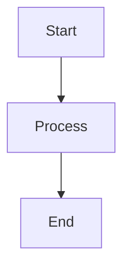

### `violations/` — Known Rule Violations

Test cases that **intentionally violate** a rule. The benchmark runner expects:
- Parser succeeds
- One or more rule violations triggered (matched to expected issues)
- Categories: bug triggers, anti-patterns, edge cases pushed too far

**Example:**
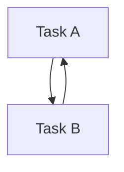

### `edge-cases/` — Boundary Conditions and Corner Cases

Test cases exploring **limits and special conditions**. May be valid or violations, but test important boundaries.

**Example:**
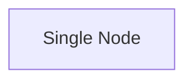

## Metadata Annotations

### `@rule` Annotation

Specifies which rule(s) this case tests:

```mermaid
%% @rule: no-cycles
%% Single rule—case tests only this rule
```

Multiple rules:
```mermaid
%% @rule: no-cycles, max-fanout
%% Tests multiple rules—first rule is primary
```

Test all rules:
```mermaid
%% @rule: *
%% Case tests all rules
```

### Optional: `@severity` Annotation

Specify expected severity (rarely needed; inferred from rule defaults):

```mermaid
%% @rule: max-fanout
%% @severity: warning
```

## Best Practices

### 1. Keep Fixtures Small and Focused

Each test case should focus on **one specific rule behavior**.

✅ **Good:** Small, targeted diagram testing exact violation
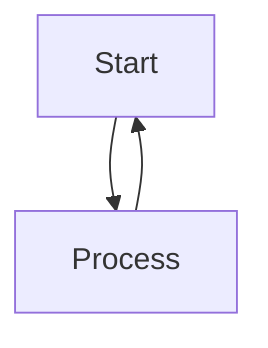

❌ **Bad:** Large, complex diagram testing multiple rules at once
```mermaid
graph TD
    A["Start"]
    B["Process"]
    C["Decision"]
    D["A"]
    A --> B
    B --> C
    C --> D
    D --> A
    B --> A
    ... (50+ more nodes)
```

### 2. Use Descriptive Labels

Node labels should hint at the test's purpose:

✅ **Good:**
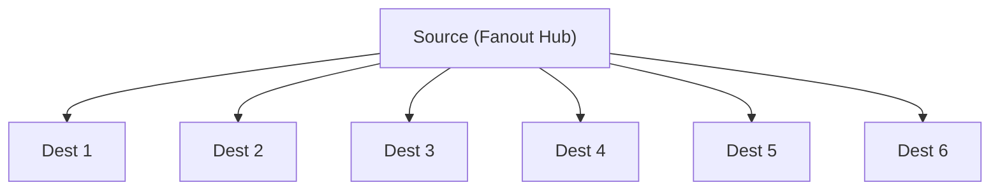

❌ **Bad:**
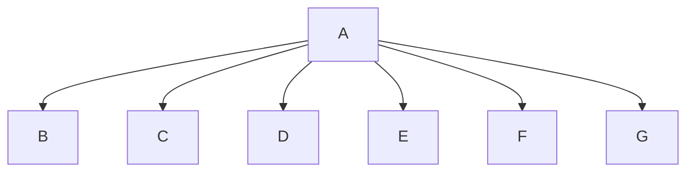

### 3. Comment Complex Test Logic

For edge cases or non-obvious violations, add Mermaid comments explaining:

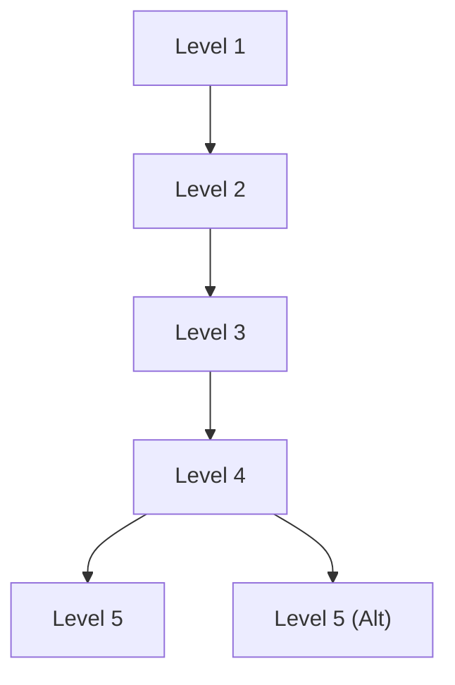

### 4. Test Rule Boundaries

For rules with configurable limits (e.g., `max-fanout: limit 5`):

- Create base case at limit: `fanout-5-nodes.mmd`
- Create violation beyond limit: `fanout-6-nodes.mmd`
- Store rule config in fixture if needed (via comment)

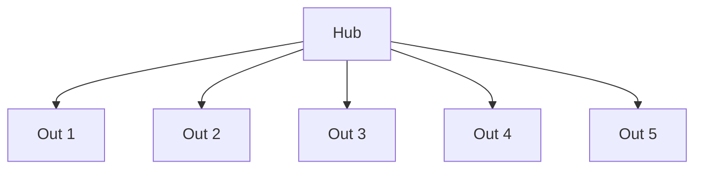

### 5. Add Tags in File Structure

Use naming patterns to organize related cases:

```
benchmarks/cases/flowchart/violations/
  ├── no-cycles-simple.mmd
  ├── no-cycles-self-loop.mmd
  ├── no-cycles-complex-ring.mmd
  ├── max-fanout-6.mmd
  ├── max-fanout-10.mmd
  └── ...
```

Or use a prefix system:

- `rule-name-category.mmd` — Organize by rule
- `category-number.mmd` — Organize by category

## Workflow: Adding a New Test Case

### 1. Identify the Gap

```bash
make benchmark
```

Review HTML report or JSON results. Look for:
- Low detection rates (<80%)
- Patterns in failed cases
- Edge cases not covered

### 2. Write the Fixture

Create a new `.mmd` file with:
- Descriptive name
- Clear labels
- Single rule focus
- Appropriate category

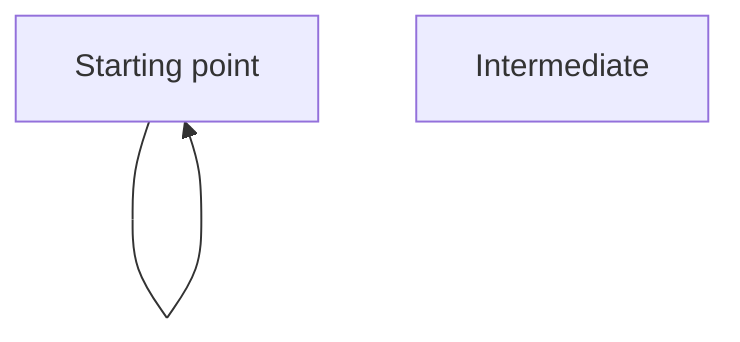

### 3. Test Locally

Run benchmarks to verify the case is discovered and works:

```bash
go run ./benchmarks/main.go --rule no-cycles --verbose
```

### 4. Review Results

Check the HTML report or JSON output:
- Is the case discovered?
- Is it passing/failing as expected?
- Are metrics reasonable?

### 5. Commit

Add to git:
```bash
git add benchmarks/cases/flowchart/violations/my-test.mmd
git commit -m "benchmark: add test case for no-cycles with self-loop"
```

## Examples

### Example 1: Valid Diagram (No Violations)

File: `benchmarks/cases/flowchart/valid/simple-linear.mmd`

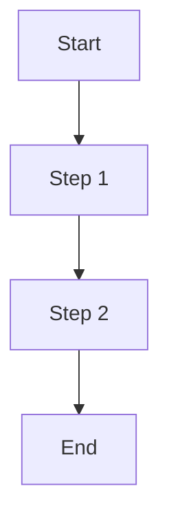

### Example 2: Violation Case

File: `benchmarks/cases/flowchart/violations/cycle-complex.mmd`

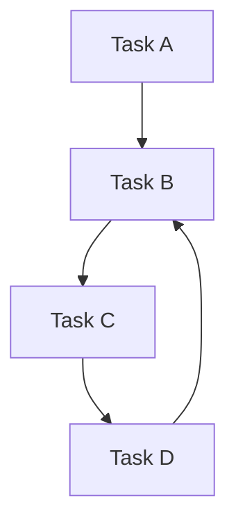

### Example 3: Edge Case

File: `benchmarks/cases/flowchart/edge-cases/single-isolated-node.mmd`

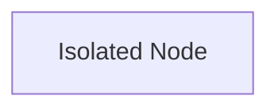

## Testing Your Changes

After adding new fixtures, verify:

1. **Discovery works:**
   ```bash
   go run ./benchmarks/main.go --verbose | grep "Discovered"
   ```

2. **No parse errors:**
   ```bash
   go run ./benchmarks/main.go --verbose 2>&1 | grep -i error
   ```

3. **Metrics improve (if fixing a gap):**
   ```bash
   go run ./benchmarks/main.go --rule no-cycles
   ```

## Questions?

- Review existing fixtures in `benchmarks/cases/` for patterns
- See [BENCHMARK.md](BENCHMARK.md) for runner documentation
- Check [../README.md](../README.md) for project overview
