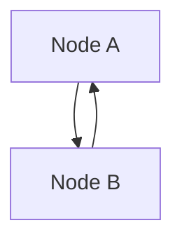

# merm8 Benchmark Suite

Welcome to the merm8 benchmark suite! This comprehensive testing framework rigorously evaluates the efficacy of mermaid code linting rules.

Similar to LLM benchmarks (FrontierScience, GDPval, HealthBench), the merm8 benchmark system:

- ✅ Defines a **curated test dataset** of real-world and synthetic mermaid diagrams
- ✅ Measures **rule detection accuracy** (detection rate, false positives)
- ✅ Tracks **performance metrics** (parse time, lint time)
- ✅ **Compares against baselines** to detect regressions
- ✅ **Generates detailed reports** (HTML + JSON) for analysis

## Quick Start

### Run All Benchmarks

```bash
make benchmark
# or
go run ./benchmarks/main.go
```

This generates:

- **HTML Report**: `benchmark.html` (interactive dashboard)
- **JSON Results**: `benchmarks/reports/latest-results.json` (structured data)
- **Text Summary**: Printed to stdout

### Docker Build Behavior (`benchmark.html`)

Container builds support two modes for `benchmark.html`:

- **Default/local mode** (`REQUIRE_BENCHMARK_HTML=false`): if `benchmark.html` is missing, Docker creates a placeholder file so local developer builds remain convenient.
- **Strict mode** (`REQUIRE_BENCHMARK_HTML=true`): build fails when `benchmark.html` is missing. Use this in CI/deploy to ensure production images include a real benchmark report.

Example strict build:

```bash
docker build --build-arg REQUIRE_BENCHMARK_HTML=true .
```

### View Results

> Historical note: `benchmarks/reports/index.html` may still be present as a temporary compatibility path, but `benchmark.html` is the canonical user-facing report location.

```bash
# Open HTML report in browser
open benchmark.html

# Or JSON results
cat benchmarks/reports/latest-results.json | jq '.'
```

### Compare Against Baseline

```bash
go run ./benchmarks/main.go --compare-baseline benchmarks/baselines/v0.1.0.json
```

Alerts on detection rate drops >5%.

## Documentation

- **[BENCHMARK.md](BENCHMARK.md)** — Framework overview and usage guide
- **[CONTRIBUTING.md](CONTRIBUTING.md)** — How to author new test cases
- **[cases/README.md](cases/README.md)** — Test case catalog and organization
- **[baselines/README.md](baselines/README.md)** — Understanding and managing baselines
- **[reports/README.md](reports/README.md)** — Generated report formats

## Directory Structure

```
benchmarks/
├── cases.go                    # Type definitions (BenchmarkCase, BenchmarkResults, etc.)
├── runner.go                   # Core benchmark runner and HTML template
├── runner_test.go              # Runner tests
├── main.go                     # CLI entry point
├── BENCHMARK.md                # Framework documentation (start here!)
├── CONTRIBUTING.md             # Case authoring guide
│
├── cases/                      # Test fixtures
│   ├── README.md               # Case catalog
│   ├── flowchart/              # Flowchart cases
│   │   ├── valid/              # Cases that should pass
│   │   ├── violations/         # Cases with known violations
│   │   └── edge-cases/         # Boundary conditions
│   ├── sequence/               # [Placeholder for future rules]
│   ├── class/
│   ├── er/
│   └── state/
│
├── baselines/                  # Stored baseline results
│   ├── README.md               # Baseline management guide
│   └── v0.1.0.json             # Initial baseline (v0.1.0)
│
└── reports/                    # Generated reports (not tracked in git)
    ├── README.md               # Report format guide
    ├── index.html              # Latest HTML report
    └── latest-results.json     # Latest JSON results
```

## Key Concepts

### Test Cases

Test cases are `.mmd` (Mermaid) files organized by:

- **Type**: flowchart, sequence, class, ER, state
- **Category**: valid, violations, edge-cases

**Example:**



The runner **auto-discovers** cases and extracts metadata from annotations.

### Metrics

For each rule, the benchmark system tracks:

| Metric              | Description                              |
| ------------------- | ---------------------------------------- |
| **Detection Rate**  | % of cases with correct results (0–100%) |
| **False Positives** | Issues reported that weren't expected    |
| **Avg Parse Time**  | Average milliseconds to parse case       |
| **Avg Lint Time**   | Average milliseconds to execute rule     |

### Baselines

Baselines are snapshots of benchmark results at specific version points (e.g., v0.1.0). They're used for:

- **Regression detection**: Alert if detection rate drops >5%
- **Trend analysis**: Track rule quality over time
- **Reproducibility**: Compare against known good results

### Reports

The benchmark runner generates two reports:

1. **HTML Report** (`benchmark.html`) — Interactive dashboard
   - Overall pass rate
   - Per-rule metrics (color-coded: green/yellow/red)
   - Failed case details
   - Mobile-responsive

2. **JSON Report** (`latest-results.json`) — Structured data
   - Complete benchmark results
   - Suitable for CI/CD pipelines
   - Easy to parse and compare

## Workflow

### As a Developer

1. **Run benchmarks** to check rule quality:

   ```bash
   make benchmark
   ```

2. **Review results** in HTML report or JSON

3. **Add new test cases** to improve coverage:

   ```bash
   # Create new fixture
   echo "graph TD\n  A --> B" > benchmarks/cases/flowchart/valid/my-test.mmd

   # Run benchmarks again
   make benchmark
   ```

4. **Compare against baseline** to detect regressions:
   ```bash
   go run ./benchmarks/main.go --compare-baseline benchmarks/baselines/v0.1.0.json
   ```

### As a Rule Developer

1. Implement the rule in `internal/rules/`
2. Add test cases to `benchmarks/cases/flowchart/{valid,violations,edge-cases}/`
3. Run benchmarks to verify detection rate >90%
4. Fix edge cases if needed
5. Commit test cases with rule PR

### As a Maintainer

1. Run benchmarks after each release
2. Review results for >90% detection rate per rule
3. If acceptable, establish new baseline:
   ```bash
   cp benchmarks/reports/latest-results.json benchmarks/baselines/v0.2.0.json
   git add benchmarks/baselines/v0.2.0.json
   git commit -m "benchmark: establish v0.2.0 baseline"
   ```
4. Track trends over time using baselines

## Commands

### Basic Usage

```bash
# Run all benchmarks
make benchmark

# Run specific rule
go run ./benchmarks/main.go -rule no-cycles

# Run only violation cases
go run ./benchmarks/main.go -category violation

# Verbose output with case details
go run ./benchmarks/main.go -verbose

# Compare against baseline with custom threshold
go run ./benchmarks/main.go \
  --compare-baseline benchmarks/baselines/v0.1.0.json \
  --regression-threshold 2.0
```

### Advanced Usage

```bash
# Combine filters
go run ./benchmarks/main.go -rule no-cycles -category violations -verbose

# Generate fresh baseline
go run ./benchmarks/main.go --output benchmarks/baselines/v0.2.0.json
```

## Expected Results

### v0.1.0 Baseline

- **Total Cases**: 15 (5 per rule)
- **Overall Pass Rate**: >85%
- **Per-Rule Detection Rate**: >90% (expected)
- **Execution Time**: ~5 seconds

See [baselines/v0.1.0.json](baselines/v0.1.0.json) for detailed metrics.

## Troubleshooting

### Issue: "parser script not found"

**Solution**: Set parser path or ensure `parser-node/` is initialized:

```bash
cd parser-node && npm install && cd ..
make benchmark
```

### Issue: Low detection rate (<80%)

**Solution**: Run with verbose output to see which cases failed:

```bash
go run ./benchmarks/main.go -verbose
```

Review failed case details in HTML report. See [cases/README.md](cases/README.md#best-practices) for case authoring guidelines.

### Issue: HTML report doesn't load

**Solution**: Serve via HTTP:

```bash
cd benchmarks/reports && python3 -m http.server 8000
# Visit http://localhost:8000/index.html
```

## Future Enhancements

- 🔲 Performance regression thresholds (e.g., rule slower than baseline)
- 🔲 Custom rule support (extend framework for plugin rules)
- 🔲 CI workflow integration (GitHub Actions, GitLab CI, etc.)
- 🔲 Trend visualization (plot detection rates over time)
- 🔲 Distributed execution (parallel case execution)

## See Also

- [../../README.md](../../README.md) — merm8 project overview
- [../../API_GUIDE.md](../../API_GUIDE.md) — API documentation
- [BENCHMARK.md](BENCHMARK.md) — In-depth framework guide
- [CONTRIBUTING.md](CONTRIBUTING.md) — Test case authoring

## Questions?

Refer to the relevant documentation file:

- **What is this?** → [BENCHMARK.md](BENCHMARK.md)
- **How do I add a test case?** → [CONTRIBUTING.md](CONTRIBUTING.md)
- **What are test cases?** → [cases/README.md](cases/README.md)
- **How do baselines work?** → [baselines/README.md](baselines/README.md)
- **What do reports contain?** → [reports/README.md](reports/README.md)
