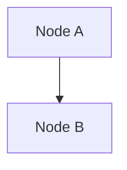
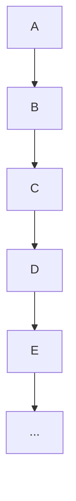
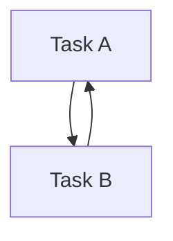

# Benchmark Test Cases

This directory contains all benchmark test cases used to evaluate merm8 rule implementations. Cases are organized by diagram type and category.

## Directory Structure

```
cases/
├── flowchart/          # Flowchart diagram test cases
│   ├── valid/          # Cases that should pass all rules
│   ├── violations/     # Cases with known rule violations
│   └── edge-cases/     # Boundary conditions and corner cases
├── sequence/           # Sequence diagram cases (placeholder)
├── class/              # Class diagram cases (placeholder)
├── er/                 # ER diagram cases (placeholder)
└── state/              # State diagram cases (placeholder)
```

## Case Categories

### `valid/`

Diagrams that **should pass linting** with no rule violations.

**Examples:**

- `simple-linear.mmd` — Three-node linear flow
- `complex-flow.mmd` — Decision tree with branches
- `parallel-paths.mmd` — Multiple paths converging
- `fully-connected.mmd` — All nodes in one connected component

**Purpose:** Verify rules correctly identify well-formed diagrams.

### `violations/`

Diagrams with **intentional rule violations**. Each fixture triggers one or more specific violations.

**Examples:**

- `simple-cycle.mmd` — Two-node circular dependency (no-cycles violation)
- `disconnected-node.mmd` — Isolated node not connected to main flow (no-disconnected-nodes violation)
- `duplicate-nodes.mmd` — Repeated node ID (no-duplicate-node-ids violation)
- `high-fanout.mmd` — Hub node with 6+ outgoing edges (max-fanout violation)

**Purpose:** Verify rules detect violations they're designed to find.

### `edge-cases/`

**Boundary conditions** and **corner cases**. May be valid or violations, but test important limits.

**Examples:**

- `single-node.mmd` — Single node with no edges (special case)
- `max-depth-at-limit.mmd` — Tree reaching exactly the depth limit
- `fanout-at-limit.mmd` — Hub with exactly the fanout limit

**Purpose:** Verify rules handle edge cases correctly.

## Case Discovery and Naming

The benchmark runner **auto-discovers** all `.mmd` files in these directories. No manual registration required.

### File Naming Convention

Use **descriptive, kebab-case names** that indicate the test's purpose:

```
✅  simple-cycle.mmd
✅  disconnected-node.mmd
✅  high-fanout-6-outputs.mmd
✅  max-depth-at-limit.mmd

❌  test1.mmd
❌  case.mmd
❌  TempTest.mmd
```

### Metadata Annotations

Each `.mmd` file can include metadata comments:



**Supported annotations:**

- `%% @rule: rule-id` — Specifies which rule this case tests
- `%% @rule: *` — Tests all rules

## Test Case Statistics

### Current Coverage (v0.1.0)

| Rule                  | Valid  | Violations | Edge Cases | Total  |
| --------------------- | ------ | ---------- | ---------- | ------ |
| no-duplicate-node-ids | 2      | 2          | 1          | 5      |
| no-disconnected-nodes | 2      | 2          | 1          | 5      |
| max-fanout            | 2      | 2          | 1          | 5      |
| no-cycles             | 2      | 2          | 1          | 5      |
| max-depth             | 2      | 2          | 1          | 5      |
| **Total**             | **10** | **10**     | **5**      | **25** |

### Target Coverage (v0.2.0+)

- **10–15 cases per rule**
- **Multiple diagram types** (not just flowchart)
- **Real-world scenarios** from production usage
- **Regression tests** for filed issues

## Adding New Cases

For detailed instructions on authoring and adding test cases, see [../CONTRIBUTING.md](../CONTRIBUTING.md).

**Quick steps:**

1. Create `.mmd` file in appropriate directory: `cases/{type}/{category}/{name}.mmd`
2. Add `%% @rule: rule-id` annotation
3. Run benchmarks: `make benchmark`
4. Commit the new fixture

## Case Quality Guidelines

### Best Practices

1. **Keep it focused** — Each case tests one rule behavior
2. **Use clear labels** — Node text should hint at the test's purpose
3. **Avoid clutter** — Small, minimal diagrams (except for scale testing)
4. **Document complexity** — Comment non-obvious test logic
5. **Test boundaries** — Include cases at rule limits (e.g., max-depth: 8)

### Anti-Patterns

❌ **Large, complex diagrams testing multiple rules simultaneously**



✅ **Small, focused diagrams testing one rule**



## Placeholder Diagram Types

Currently, rules are only implemented for **flowchart** diagrams. Placeholder directories exist for future rule implementations:

- `sequence/` — For sequence diagram rules (when implemented)
- `class/` — For class diagram rules (when implemented)
- `er/` — For ER diagram rules (when implemented)
- `state/` — For state diagram rules (when implemented)

## Mermaid Syntax Resources

For reference on valid Mermaid syntax:

- [Mermaid.js Documentation](https://mermaid.js.org/)
- [Flowchart Syntax](https://mermaid.js.org/syntax/flowchart.html)
- [Official Examples](https://mermaid.live/)

## See Also

- [../BENCHMARK.md](../BENCHMARK.md) — Benchmark framework documentation
- [../CONTRIBUTING.md](../CONTRIBUTING.md) — Detailed case authoring guide
- [../baselines/](../baselines/) — Stored benchmark baselines
