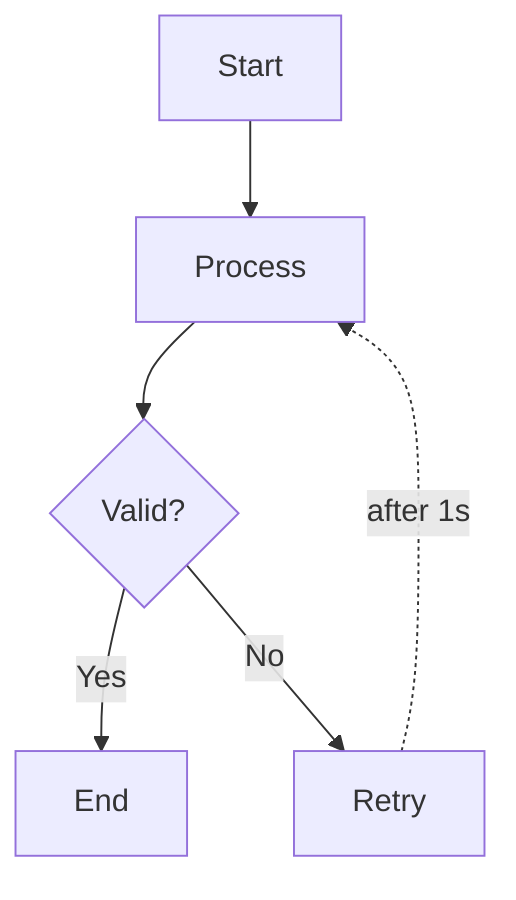
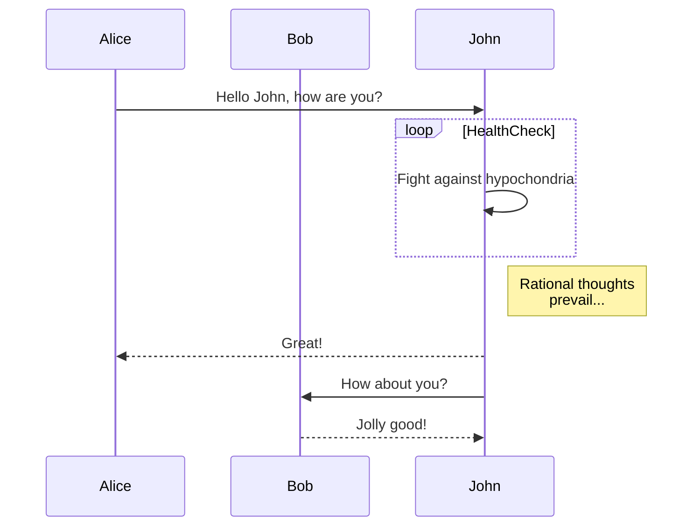
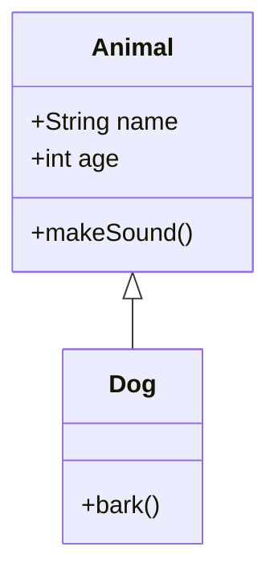
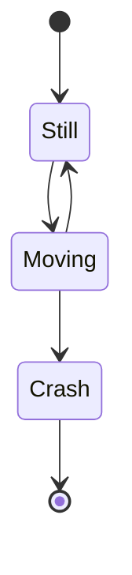
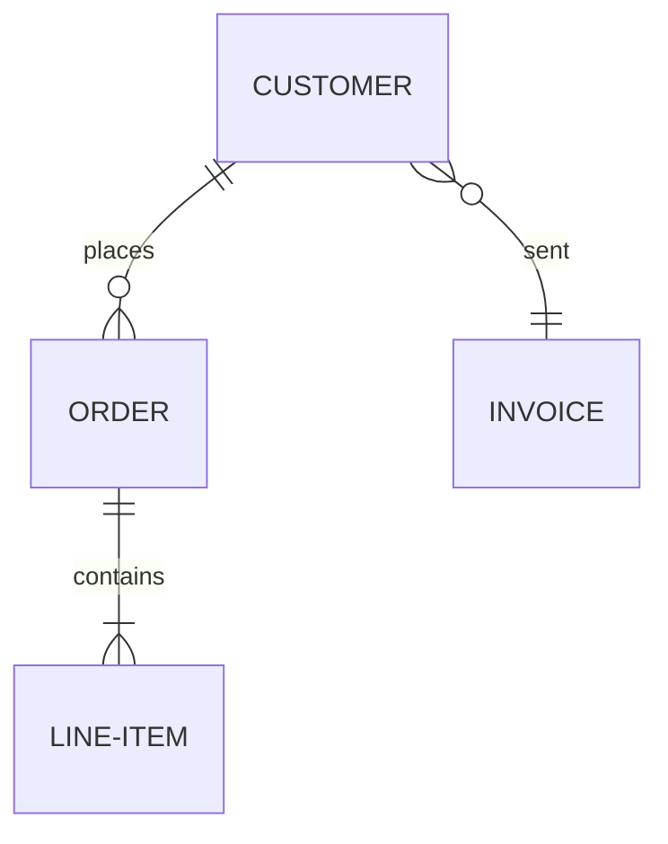

# Diagram Type Support Matrix

This document clarifies which Mermaid diagram types are **parser-recognized** (syntactically valid) vs. **lint-supported** (rules are available).

---

## Overview

merm8 classifies diagram types in two categories:

1. **Parser-Recognized**: The Mermaid parser accepts the syntax as valid. The `diagram-type` field in the response will be set.
2. **Lint-Supported**: Rules are available and will be evaluated. The `lint-supported` field in the response will be `true`; linting runs only for these types.

**Important**: If a diagram is **parser-recognized** but **not lint-supported**, analysis succeeds, no errors are returned, but rules are skipped.

---

## Support Matrix

| Diagram Type                 | Parser-Recognized | Lint-Supported | Rules Available                                                                | Status           | Notes                                |
| ---------------------------- | ----------------- | -------------- | ------------------------------------------------------------------------------ | ---------------- | ------------------------------------ |
| **flowchart** (aka graph)    | ✅                | ✅             | max-fanout, max-depth, no-cycles, no-disconnected-nodes, no-duplicate-node-ids | ✅ Stable        | Primary use case; all rules active   |
| **sequence**                 | ✅                | ❌ (planned)   | —                                                                              | 🔜 Planned       | Valid Mermaid; no lint rules yet     |
| **class**                    | ✅                | ❌ (planned)   | —                                                                              | 🔜 Planned       | Valid Mermaid; no lint rules yet     |
| **state**                    | ✅                | ❌ (planned)   | —                                                                              | 🔜 Planned       | Valid Mermaid; no lint rules yet     |
| **er** (entity-relationship) | ✅                | ❌ (planned)   | —                                                                              | 🔜 Planned       | Valid Mermaid; no lint rules yet     |
| **gantt**                    | ❌                | ❌             | —                                                                              | ❌ Not supported | Parser rejects; returns syntax error |
| **pie**                      | ❌                | ❌             | —                                                                              | ❌ Not supported | Parser rejects; returns syntax error |

---

## Flowchart (Current Focus)

The flowchart (and its alias `graph`) is the primary diagram type with full lint support.

### Example



### Applied Rules

All 5 implemented rules run on flowchart diagrams:

| Rule                      | Default Severity | Configurable                    |
| ------------------------- | ---------------- | ------------------------------- |
| **max-fanout**            | warning          | limit (default 5)               |
| **max-depth**             | warning          | limit (default 8)               |
| **no-cycles**             | error            | allow-self-loop (default false) |
| **no-disconnected-nodes** | error            | —                               |
| **no-duplicate-node-ids** | error            | —                               |

### Example Request/Response

**Request**:

```json
{
  "code": "graph TD\n  A[Start] --> B[End]",
  "config": {
    "schema-version": "v1",
    "rules": {
      "max-fanout": { "limit": 5 },
      "max-depth": { "limit": 8 }
    }
  }
}
```

**Response** (HTTP 200 OK):

```json
{
  "valid": true,
  "diagram-type": "flowchart",
  "lint-supported": true,
  "issues": [],
  "metrics": {
    "diagram-type": "flowchart",
    "node-count": 2,
    "edge-count": 1
  }
}
```

---

## Sequence Diagram (Parser-Recognized, Not Yet Lint-Supported)

Valid Mermaid syntax but no rules available yet.

### Example



### Example Request/Response

**Request**:

```json
{
  "code": "sequenceDiagram\n  participant A\n  participant B\n  A->>B: Hello"
}
```

**Response** (HTTP 200 OK):

```json
{
  "valid": true,
  "diagram-type": "sequence",
  "lint-supported": false,
  "issues": [],
  "metrics": {
    "diagram-type": "sequence"
  }
}
```

**Note**: `lint-supported=false` indicates syntax is valid but linting was skipped because no rules are available for this diagram type.

---

## Class Diagram (Parser-Recognized, Not Yet Lint-Supported)

Valid Mermaid syntax but no rules available yet.

### Example



### Example Request/Response

**Response** (HTTP 200 OK):

```json
{
  "valid": true,
  "diagram-type": "class",
  "lint-supported": false,
  "issues": []
}
```

---

## State Diagram (Parser-Recognized, Not Yet Lint-Supported)

Valid Mermaid syntax but no rules available yet.

### Example



### Example Request/Response

**Response** (HTTP 200 OK):

```json
{
  "valid": true,
  "diagram-type": "state",
  "lint-supported": false,
  "issues": []
}
```

---

## ER Diagram (Parser-Recognized, Not Yet Lint-Supported)

Valid Mermaid syntax but no rules available yet.

### Example



### Example Request/Response

**Response** (HTTP 200 OK):

```json
{
  "valid": true,
  "diagram-type": "er",
  "lint-supported": false,
  "issues": []
}
```

---

## Unsupported Diagram Types

The following Mermaid diagram types are **not currently supported** and will return a syntax error:

| Type  | Reason                                                         | Suggested Alternative                                |
| ----- | -------------------------------------------------------------- | ---------------------------------------------------- |
| Gantt | Complex time-based syntax; out of scope for current lint rules | Use project management tool + embed diagrams in docs |
| Pie   | Not a flow/structure diagrams; limited linting value           | Document metrics separately                          |

### Example: Unsupported Type

**Request**:

```json
{
  "code": "gantt\n  title My Project\n  section Development\n    Task1 :t1, 2024-01-01, 30d"
}
```

**Response** (HTTP 200 OK, but empty results):

```json
{
  "valid": false,
  "diagram-type": "unknown",
  "lint-supported": false,
  "syntax-error": {
    "message": "Parser does not recognize gantt syntax",
    "line": 1,
    "column": 1
  },
  "issues": []
}
```

---

## Roadmap: Future Lint Support

### Phase 2 (Q3 2026): Sequence Diagram Rules

Planned rules for sequence diagrams:

- **sequence-max-participants**: Limit number of actors (prevent overwhelming diagrams)
- **sequence-message-ordering**: Ensure messages don't violate actor interaction order

### Phase 3 (Q4 2026): Class Diagram Rules

Planned rules for class diagrams:

- **class-no-orphan-classes**: Ensure all classes are connected to inheritance hierarchy
- **class-max-depth**: Limit inheritance depth to prevent overly complex hierarchies

### Phase 4 (beyond 2026): ER & State Diagrams

Rules for entity-relationship and state diagrams for completeness.

---

## Determining diagram-type at Runtime

When you send a diagram to `/v1/analyze`, the response includes the detected `diagram-type`:

```json
{
  "valid": true,
  "diagram-type": "flowchart",  // ← Detected by parser
  "lint-supported": true,
  "issues": [...]
}
```

You can use this to:

1. Validate the diagram was interpreted as the intended type
2. Decide whether to expect lint results
3. Show appropriate UI based on supported rules

### Multi-diagram Files

If you're analyzing multiple diagrams in a CI pipeline, check the `diagram-type` of each response:

```bash
# Bulk analyze
for diagram in *.mmd; do
  type=$(curl -s -X POST /v1/analyze \
    -d "{\"code\":\"$(cat $diagram)\"}" \
    | jq -r '.diagram-type')

  if [ "$type" == "flowchart" ]; then
    echo "✅ $diagram is linted"
  else
    echo "⚠️  $diagram is recognized but not linted"
  fi
done
```

---

## Configuration by Diagram Type

You can configure different rules based on diagram type detected:

```json
{
  "code": "...",
  "config": {
    "schema-version": "v1",
    "rules": {
      "max-fanout": {
        "enabled": true,
        "limit": 5
      },
      "max-depth": {
        "enabled": true,
        "limit": 8
      }
    }
  }
}
```

Currently this applies to **all lint-supported diagrams** (flowchart). Once sequence/class rules are available, the same config structure will extend to those types.

---

## Frequently Asked Questions

**Q: My diagram is valid but `lint-supported=false`. Is something wrong?**

A: No, it's working as expected. Parser recognized the diagram type (syntax valid), but no lint rules are available yet for that type. File GitHub issue if you'd like rules for that diagram type.

**Q: Can I lint sequence diagrams now?**

A: No, sequence diagram rules are planned for Q3 2026. For now, sequence diagrams are recognized but not linted.

**Q: What if I have a flowchart with mixed subgraph types?**

A: The main diagram type is `flowchart`. Subgraphs within flowcharts don't change the top-level diagram type, and all flowchart rules apply to the whole diagram.

**Q: Can I disable linting for a diagram type?**

A: Yes, via suppression selectors. Set `"suppression-selectors": ["rule:all"]` to suppress all rules, or suppress specific rules per node/subgraph.

---

## See Also

- [Rule Fix Examples](./examples/rule-fixes.md)
- [Configuration Examples](./examples/config-examples.md)
- [Mermaid Syntax Guide](https://mermaid.js.org/intro/)
