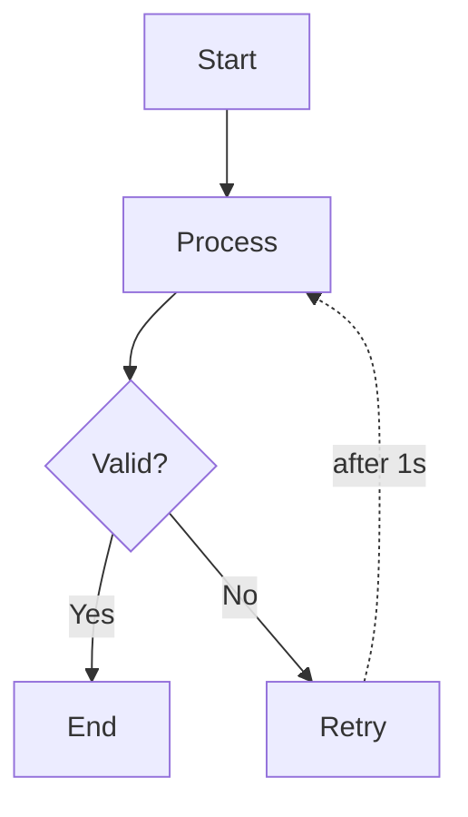

# Diagram Type Support Matrix

This document clarifies which Mermaid diagram types are **parser-recognized** (syntactically valid) vs. **lint-supported** (rules are available).

---

## Overview

merm8 classifies diagram types in two categories:

1. **Parser-Recognized**: The Mermaid parser accepts the syntax as valid. The `diagram-type` field in the response will be set.
2. **Lint-Supported**: Rules are available and will be evaluated. The `lint-supported` field in the response will be `true`; linting runs only for these types.

**Important**: If a diagram is **parser-recognized** but **not lint-supported**, analysis succeeds, no errors are returned, but rules are skipped.

---

## Understanding API Response Fields for Diagram Type Support

The API response includes two fields that control how you should interpret analysis results:

### `valid` Field

**Meaning**: `true` = syntactically correct Mermaid syntax; `false` = parsing failed

- `valid=true`: Diagram parsed successfully (regardless of lint support)
- `valid=false`: Mermaid syntax is invalid; see `syntax-error` for details

**Important**: `valid` does **NOT** indicate whether linting is supported. Use `lint-supported` to determine that.

**Example**:

```json
{
  "valid": true,                    // Syntax is correct
  "diagram-type": "sequence",       // Type was successfully identified
  "lint-supported": true,           // Sequence rules are available
  "syntax-error": null,             // No syntax errors
  "issues": []
}
```

### `lint-supported` Field

**Meaning**: `true` = linting rules are available and were evaluated; `false` = linting rules not available for this type

- `lint-supported=true`: Rules ran and `issues` array contains lint results
- `lint-supported=false`: Linting was skipped; `issues` will be empty or contain only info-level messages

**Example**:

| Scenario | valid | lint-supported | syntax-error | issues | Interpretation |
|----------|-------|----------------|--------------|--------|---|
| Valid flowchart, no issues | true | true | null | [] | Success; diagram is valid and passes all rules |
| Valid flowchart, has issues | true | true | null | [{rule-id: ..., }] | Success; diagram is valid but has lint violations |
| Syntax error | false | true | {msg...} | [] | Failure; diagram syntax is invalid |
| Valid sequence diagram | true | true | null | [] or family-specific issues | Success; sequence rules were evaluated |
| Unsupported diagram (gantt/pie) | false | false | {msg...} | [] | Failure; diagram type not recognized by parser |

---

## Key Takeaway

**If you see `valid=true` with `lint-supported=false`, the active engine has no registered rules for that family.** It means:

- ✅ Diagram syntax is **correct**
- ℹ️ Linting is **not available in this engine configuration**
- ℹ️ Query `/v1/diagram-types` to discover the registered families

---

## Support Matrix

| Diagram Type                 | Parser-Recognized | Lint-Supported | Rules Available                                                                | Status           | Notes                                |
| ---------------------------- | ----------------- | -------------- | ------------------------------------------------------------------------------ | ---------------- | ------------------------------------ |
| **flowchart** (aka graph)    | ✅                | ✅             | max-fanout, max-depth, no-cycles, no-disconnected-nodes, no-duplicate-node-ids | ✅ Stable        | Primary use case; all rules active   |
| **sequence**                 | ✅                | ✅             | no-undefined-actors, no-duplicate-actors, max-nesting-depth                     | ✅ Supported     | Sequence rules active                |
| **class**                    | ✅                | ✅             | no-circular-inheritance, no-duplicate-classes, max-inheritance-depth            | ✅ Supported     | Class rules active                   |
| **state**                    | ✅                | ✅             | no-circular-transitions, no-unreachable-state, max-transitions                   | ✅ Supported     | State rules active                   |
| **er** (entity-relationship) | ✅                | ✅             | no-circular-chain, no-self-referential                                           | ✅ Supported     | ER rules active                      |
| **gantt**                    | ❌                | ❌             | —                                                                              | ❌ Not supported | Parser rejects; returns syntax error |
| **pie**                      | ❌                | ❌             | —                                                                              | ❌ Not supported | Parser rejects; returns syntax error |

---

## Flowchart (Current Focus)

The flowchart (and its alias `graph`) is the primary diagram type with full lint support.

### Example


```mermaid
graph TD
    A[Start] --> B[Process]
    B --> C{Valid?}
    C -->|Yes| D[End]
    C -->|No| E[Retry]
    E -.->|after 1s| B
```

### Applied Rules

All 5 implemented rules run on flowchart diagrams:

| Rule                      | Default Severity | Configurable                    |
| ------------------------- | ---------------- | ------------------------------- |
| **max-fanout**            | warning          | limit (default 5)               |
| **max-depth**             | warning          | limit (default 8)               |
| **no-cycles**             | error            | allow-self-loop (default false) |
| **no-disconnected-nodes** | error            | —                               |
| **no-duplicate-node-ids** | error            | —                               |

### Example Request/Response

**Request**:

```json
{
  "code": "graph TD\n  A[Start] --> B[End]",
  "config": {
    "schema-version": "v1",
    "rules": {
      "max-fanout": { "limit": 5 },
      "max-depth": { "limit": 8 }
    }
  }
}
```

**Response** (HTTP 200 OK):

```json
{
  "valid": true,
  "diagram-type": "flowchart",
  "lint-supported": true,
  "issues": [],
  "metrics": {
    "diagram-type": "flowchart",
    "node-count": 2,
    "edge-count": 1
  }
}
```

---

## Sequence Diagram (Lint-Supported)

The default engine evaluates `no-undefined-actors`, `no-duplicate-actors`, and
`max-nesting-depth`. Successful responses report `"lint-supported": true`.

## Class Diagram (Lint-Supported)

The default engine evaluates `no-circular-inheritance`, `no-duplicate-classes`,
and `max-inheritance-depth`.

## State Diagram (Lint-Supported)

The default engine evaluates `no-circular-transitions`, `no-unreachable-state`,
and `max-transitions`.

## ER Diagram (Lint-Supported)

The default engine evaluates `no-circular-chain` and `no-self-referential`.

---

## Unsupported Diagram Types

The following Mermaid diagram types are **not currently supported** and will return a syntax error:

| Type  | Reason                                                         | Suggested Alternative                                |
| ----- | -------------------------------------------------------------- | ---------------------------------------------------- |
| Gantt | Complex time-based syntax; out of scope for current lint rules | Use project management tool + embed diagrams in docs |
| Pie   | Not a flow/structure diagrams; limited linting value           | Document metrics separately                          |

### Example: Unsupported Type

**Request**:

```json
{
  "code": "gantt\n  title My Project\n  section Development\n    Task1 :t1, 2024-01-01, 30d"
}
```

**Response** (HTTP 200 OK, but empty results):

```json
{
  "valid": false,
  "diagram-type": "unknown",
  "lint-supported": false,
  "syntax-error": {
    "message": "Parser does not recognize gantt syntax",
    "line": 1,
    "column": 1
  },
  "issues": []
}
```

---

## Future Rule Expansion

All parser-recognized families have an initial rule set. Additional rules may be
added without changing the family-level capability contract. Query `/v1/rules`
for the rule IDs registered by a deployment.

---

## Determining diagram-type at Runtime

When you send a diagram to `/v1/analyze`, the response includes the detected `diagram-type`:

```json
{
  "valid": true,
  "diagram-type": "flowchart",  // ← Detected by parser
  "lint-supported": true,
  "issues": [...]
}
```

You can use this to:

1. Validate the diagram was interpreted as the intended type
2. Decide whether to expect lint results
3. Show appropriate UI based on supported rules

### Multi-diagram Files

If you're analyzing multiple diagrams in a CI pipeline, check the `diagram-type` of each response:

```bash
# Bulk analyze
for diagram in *.mmd; do
  type=$(curl -s -X POST /v1/analyze \
    -d "{\"code\":\"$(cat $diagram)\"}" \
    | jq -r '.diagram-type')

  supported=$(curl -s /v1/diagram-types | jq --arg type "$type" '."lint-supported" | index($type) != null')
  if [ "$supported" = true ]; then
    echo "✅ $diagram is linted"
  else
    echo "⚠️  $diagram is recognized but not linted by this engine"
  fi
done
```

---

## Configuration by Diagram Type

You can configure different rules based on diagram type detected:

```json
{
  "code": "...",
  "config": {
    "schema-version": "v1",
    "rules": {
      "max-fanout": {
        "enabled": true,
        "limit": 5
      },
      "max-depth": {
        "enabled": true,
        "limit": 8
      }
    }
  }
}
```

This configuration structure applies to every lint-supported family. Rule IDs are family-specific; query `/v1/rules` for the active registry.

---

## Frequently Asked Questions

**Q: My diagram is valid but `lint-supported=false`. Is something wrong?**

A: The parser recognized the syntax, but the active engine has no rules registered for that family. The default Go engine supports flowchart, sequence, class, ER, and state; custom engines may support fewer families.

**Q: Can I lint sequence diagrams now?**

A: Yes. The default Go engine includes sequence-specific rules; check `/v1/rules` for the exact active set.

**Q: What if I have a flowchart with mixed subgraph types?**

A: The main diagram type is `flowchart`. Subgraphs within flowcharts don't change the top-level diagram type, and all flowchart rules apply to the whole diagram.

**Q: Can I disable linting for a diagram type?**

A: Yes, via suppression selectors. Set `"suppression-selectors": ["rule:all"]` to suppress all rules, or suppress specific rules per node/subgraph.

---

## See Also

- [Rule Fix Examples](./examples/rule-fixes.md)
- [Configuration Examples](./examples/config-examples.md)
- [Mermaid Syntax Guide](https://mermaid.js.org/intro/)
