# Mermaid Diagram Templates

Collection of Mermaid diagram templates compatible with merm8 linting.

## Flowchart Templates

### Basic Linear Flow

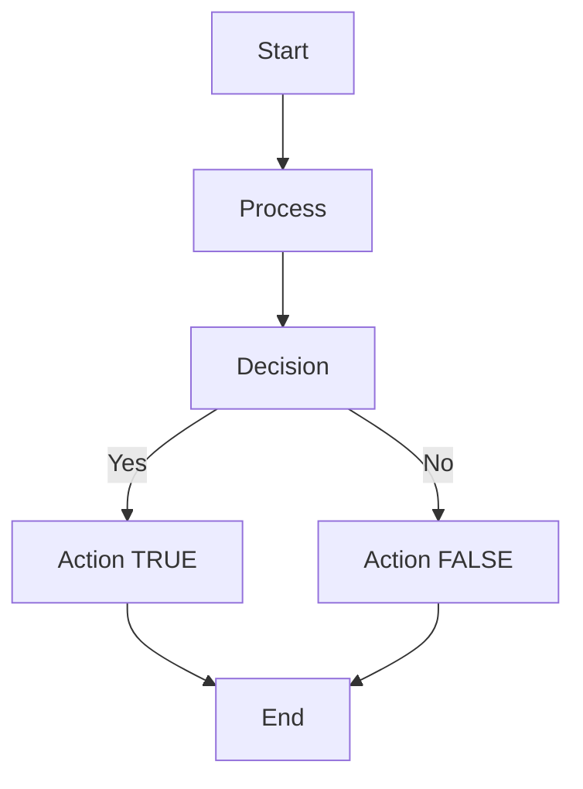

### Parallel Processes

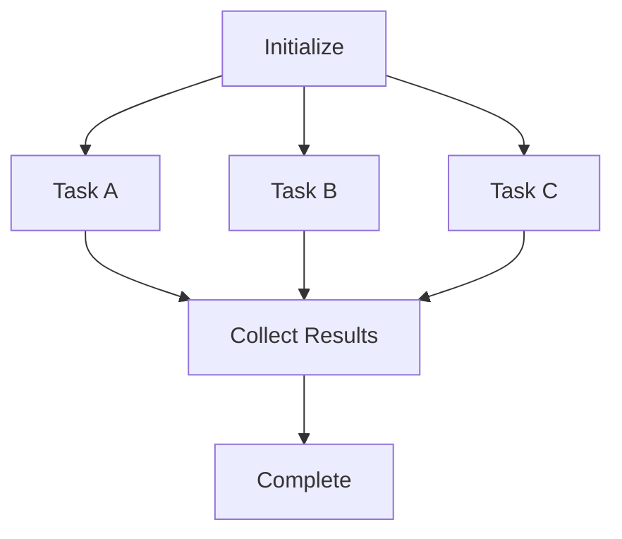

### Hierarchical System

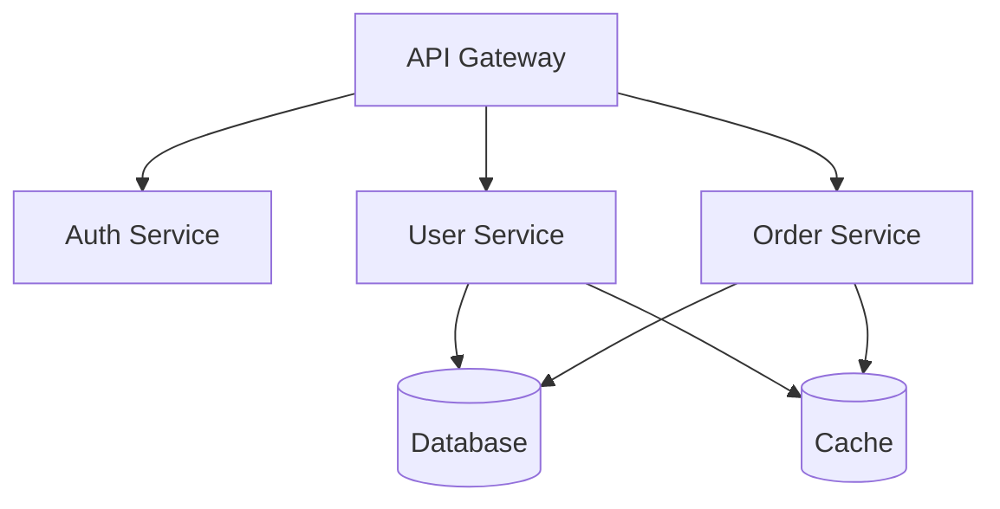

### Error Handling Pipeline

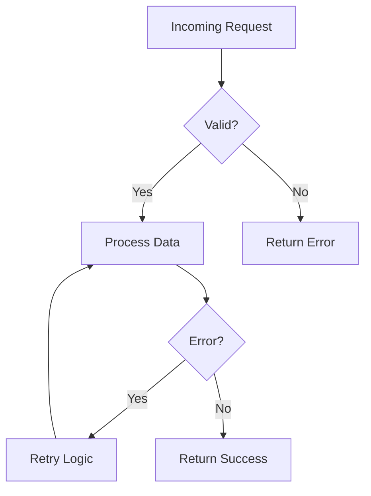

### Microservices Architecture

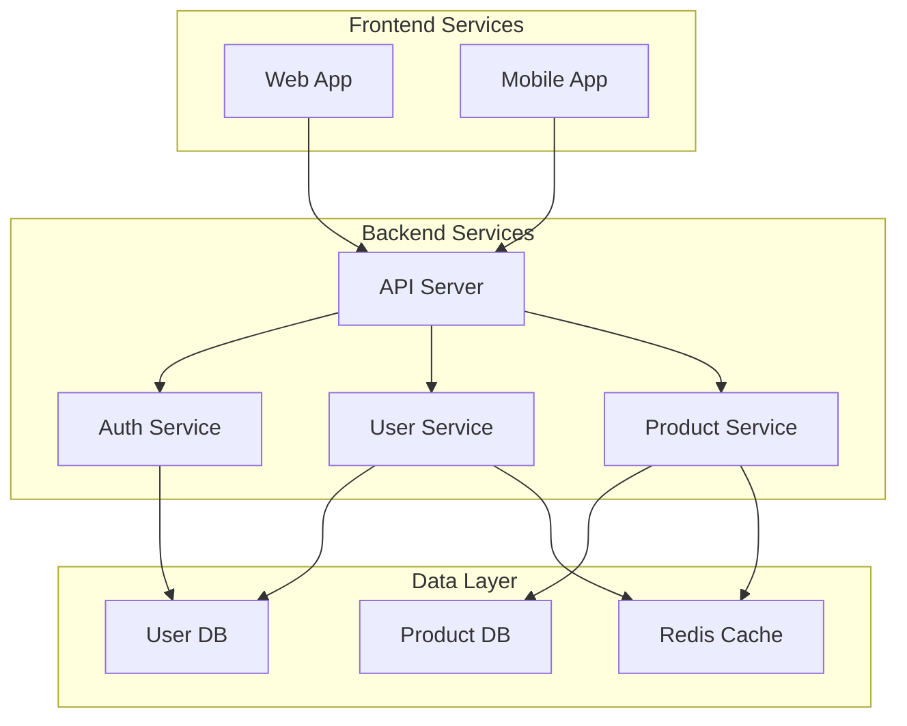

### State Machine

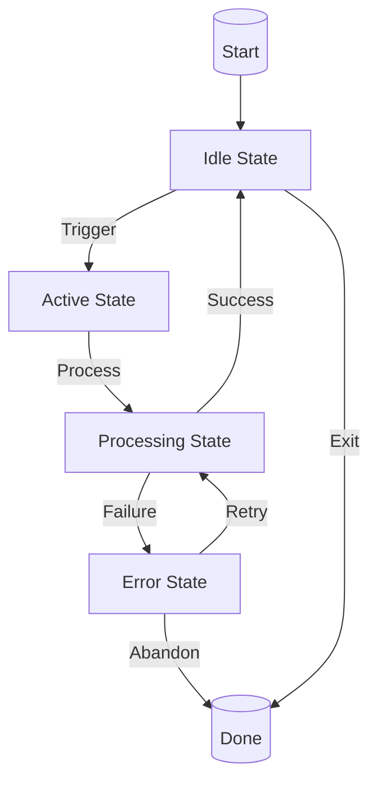

## Sequence Diagram Templates (Parser-supported, lint rules not yet enabled)

### Client-Server Interaction

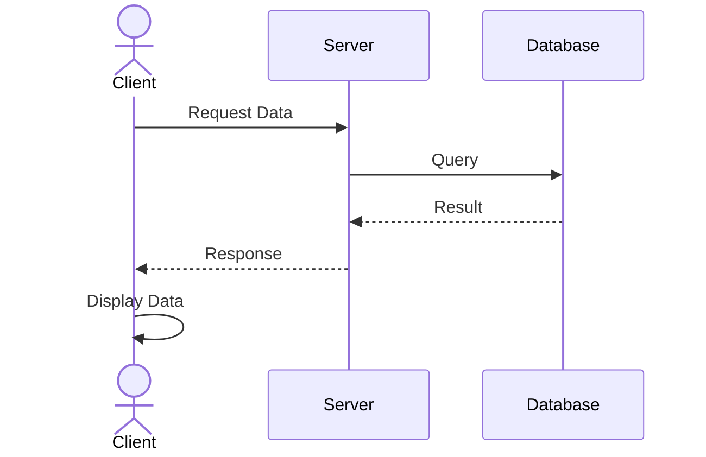

### Multi-party Communication

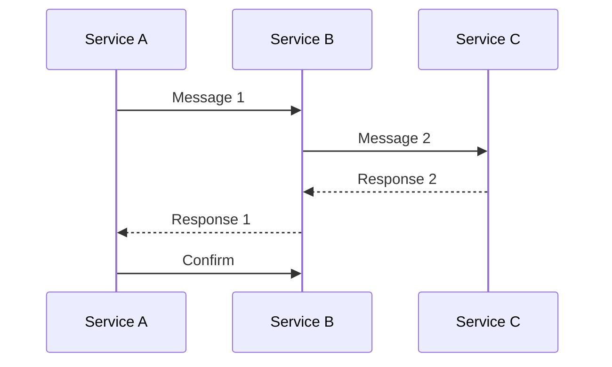

## Class Diagram Templates (Parser-supported, lint rules not yet enabled)

### Inheritance Hierarchy

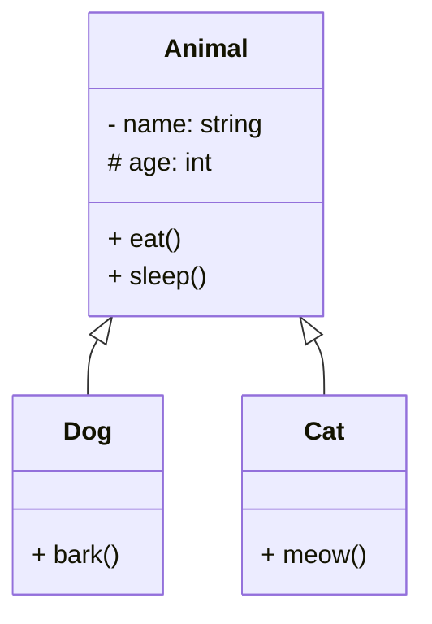

### Composition Pattern

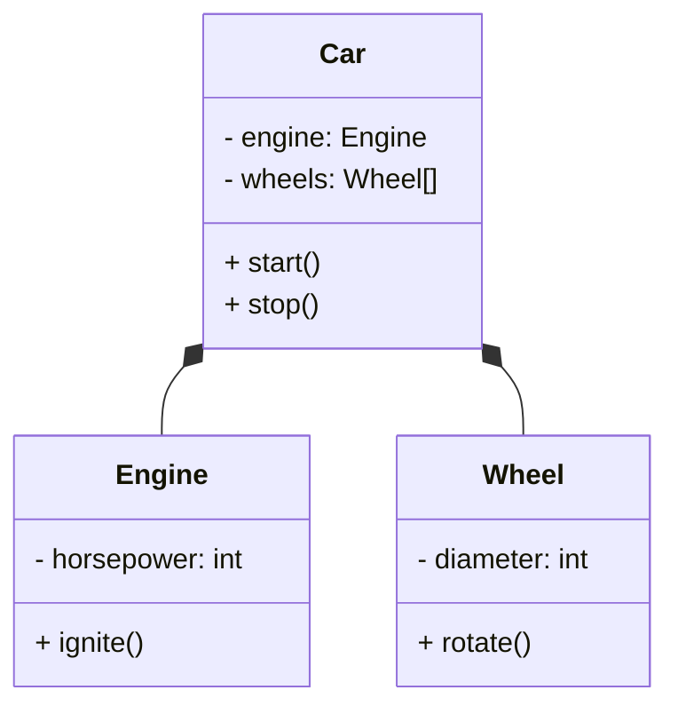

## Entity-Relationship Diagram Templates (Parser-supported, lint rules not yet enabled)

### E-commerce Schema

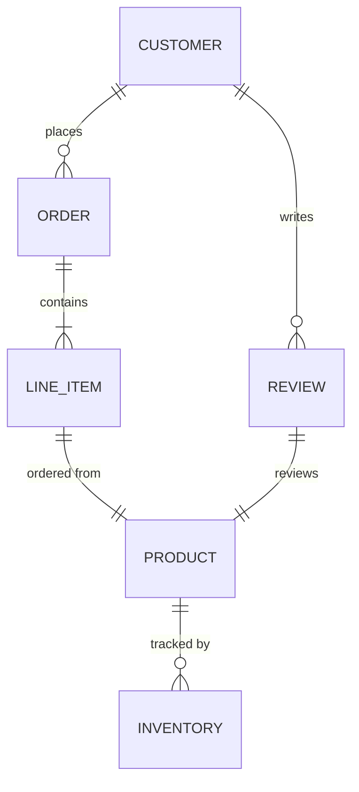

## State Diagram Templates (Parser-supported, lint rules not yet enabled)

### Simple State Machine

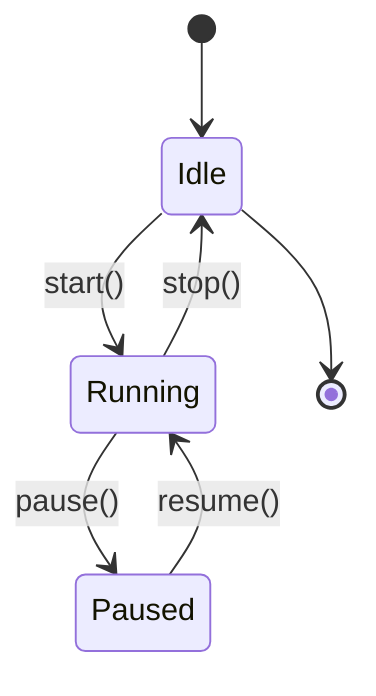

### Order Processing Workflow

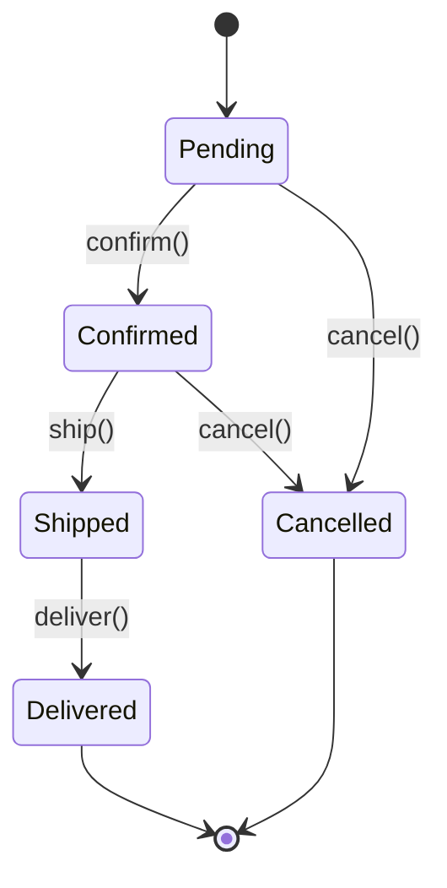

## Best Practices for linting

1. **Use descriptive labels:** Clear node names make diagrams easier to understand and lint.

   ✅ Good:

   ```mermaid
   graph TD
       A[User Signup] --> B[Email Verification]
       B --> C[Account Created]
   ```

   ❌ Avoid:

   ```mermaid
   graph TD
       A[A] --> B[B]
       B --> C[C]
   ```

2. **Keep fanout reasonable:** Limit outgoing edges per node (default max is 10).

   ✅ Recommended:

   ```mermaid
   graph TD
       API[API] --> Auth[Auth Service]
       API --> User[User Service]
       API --> Order[Order Service]
   ```

   ❌ Excessive:

   ```mermaid
   graph TD
       API[API] --> A[Service 1]
       API --> B[Service 2]
       API --> C[Service 3]
       API --> D[Service 4]
       API --> E[Service 5]
   ```

3. **Avoid disconnected nodes:** Every node should have at least one connection.

   ✅ Good:

   ```mermaid
   graph TD
       A[Start] --> B[Process]
       B --> C[End]
   ```

   ❌ Avoid:

   ```mermaid
   graph TD
       A[Start] --> B[Process]
       C[Orphaned Node]
   ```

4. **No cycles for acyclic systems:** Unless explicitly intended, avoid circular dependencies.

   ✅ Good DAG:

   ```mermaid
   graph TD
       Client --> API
       API --> Cache
       Cache --> DB
   ```

   ❌ Cyclic (unless needed):

   ```mermaid
       Service A --> Service B
       Service B --> Service C
       Service C --> Service A
   ```

5. **Reasonable depth:** Web-rendered diagrams with excessive nesting may be hard to read (default max is 10 levels).

   ✅ Manageable:

   ```mermaid
   graph TD
       A --> B
       B --> C
       C --> D
       D --> E
   ```

   ❌ Deep nesting:

   ```mermaid
   graph TD
       L1 --> L2 --> L3 --> L4 --> L5 --> L6 --> L7 --> L8 --> L9 --> L10 --> L11
   ```

## Common Linting Issues and Fixes

### Issue: "Diagram type is not supported for linting"

**Cause:** You're using a diagram type that merm8 doesn't lint yet (sequence, class, state, ER).

**Fix:** Either:

- Rewrite as a flowchart (Mermaid directive `graph` or `flowchart`)
- Wait for future releases with broader linting support

### Issue: Duplicate Node IDs

**Error:** `core/no-duplicate-node-ids`

**Example:**

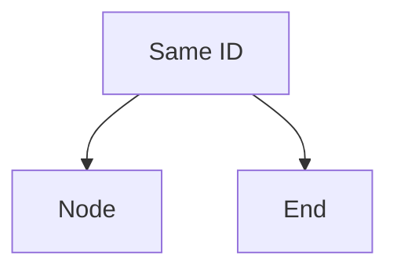

**Fix:** Rename one of the conflicting nodes.

### Issue: Disconnected Nodes

**Error:** `core/no-disconnected-nodes`

**Example:**

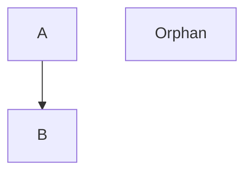

**Fix:** Connect orphan nodes or suppress them in config.

### Issue: High Fanout

**Error:** `core/max-fanout` (default limit: 10)

**Example:**

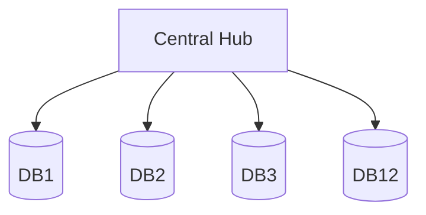

**Fix:** Introduce intermediate nodes or increase limit in config.

### Issue: Excessive Depth

**Error:** `core/max-depth` (default limit: 10)

**Example:**

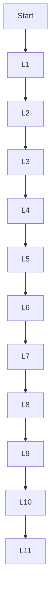

**Fix:** Refactor into parallel branches or increase limit in config.

### Issue: Circular Dependencies

**Error:** `core/no-cycles`

**Example:**

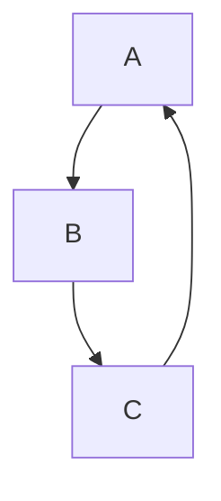

**Fix:** Remove one edge to break the cycle or suppress in config if intentional.
