# Rule Fix Examples

This directory contains concrete before/after examples for each implemented linting rule in merm8.

---

## max-fanout

**Purpose**: Limits the maximum number of outgoing edges from a single node (fan-out).

⚠️ **Violation**: Node has too many outgoing connections, making the diagram hard to follow.

### ❌ Before (Violation)

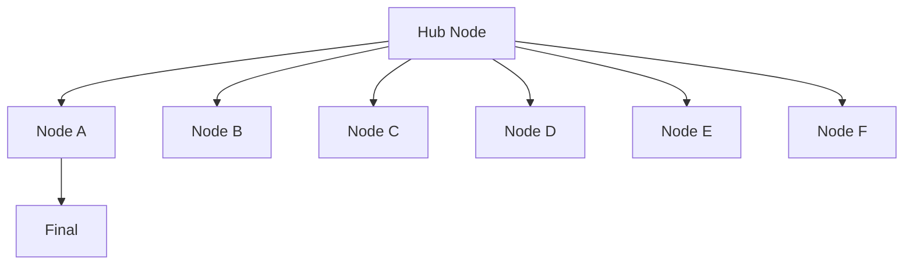

**Issue**: Node `Hub` has 6 outgoing edges, exceeding the default limit of 5.

**Config to trigger**:
```json
{
  "rules": {
    "max-fanout": {
      "enabled": true,
      "limit": 5,
      "severity": "warning"
    }
  }
}
```

### ✅ After (Fixed)

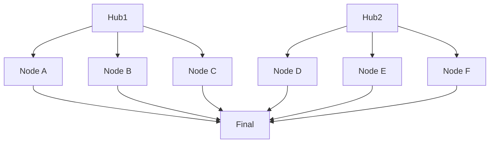

**Solution**: Split the hub node into two intermediate hubs, each with ≤ 5 outgoing edges, then merge at the final node.

**Config to allow**:
```json
{
  "rules": {
    "max-fanout": {
      "limit": 5
    }
  }
}
```

**Alternative (suppress specific node)**:
```json
{
  "rules": {
    "max-fanout": {
      "suppression-selectors": ["node:Hub"]
    }
  }
}
```

---

## max-depth

**Purpose**: Limits the maximum depth (longest path) from any source to sink node.

⚠️ **Violation**: Diagram is too deeply nested, indicating complex control flow or unbalanced branching.

### ❌ Before (Violation)

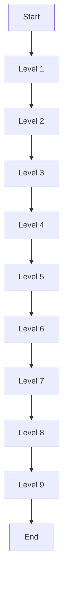

**Issue**: Maximum depth is 10 (from `A` to `K`), exceeding the default limit of 8.

**Config to trigger**:
```json
{
  "rules": {
    "max-depth": {
      "enabled": true,
      "limit": 8,
      "severity": "warning"
    }
  }
}
```

### ✅ After (Fixed)

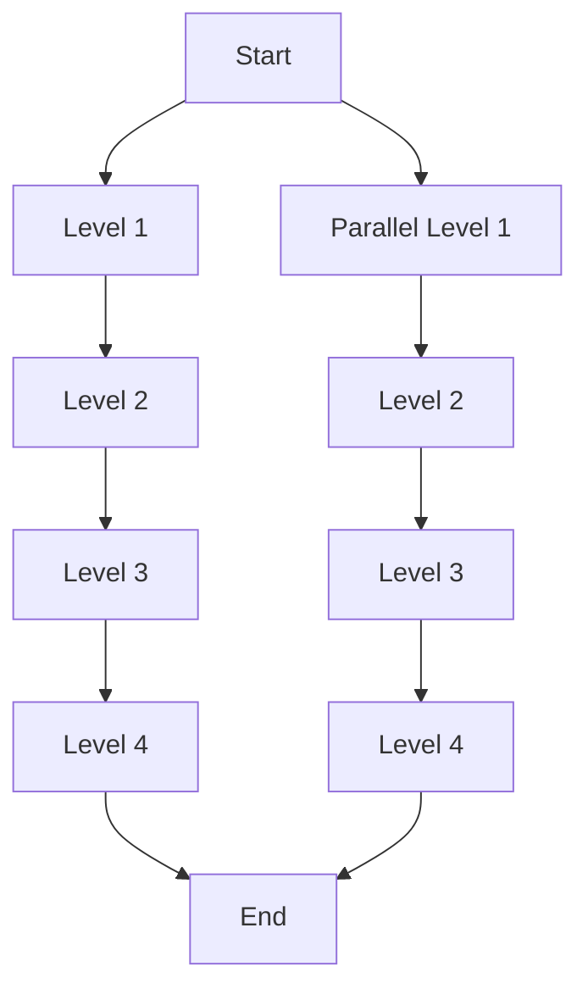

**Solution**: Refactor deep linear chain into parallel paths, keeping max depth ≤ 8.

**Config to allow**:
```json
{
  "rules": {
    "max-depth": {
      "limit": 8
    }
  }
}
```

**Increase limit if necessary** (use sparingly):
```json
{
  "rules": {
    "max-depth": {
      "limit": 12
    }
  }
}
```

---

## no-cycles

**Purpose**: Ensures the diagram is acyclic (a DAG), preventing infinite loops.

⚠️ **Violation**: Graph contains a cycle, which violates flowchart semantics.

### ❌ Before (Violation)

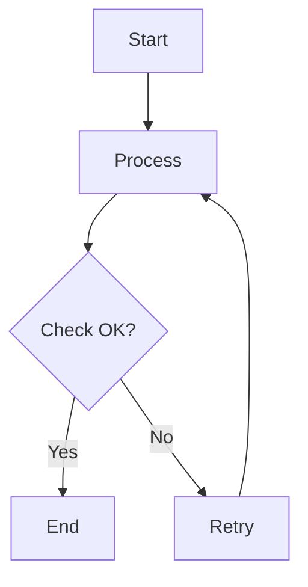

**Issue**: Cycle detected: `B → C → E → B`. The `Retry` node points back to `Process`, creating a loop.

**Config to trigger**:
```json
{
  "rules": {
    "no-cycles": {
      "enabled": true,
      "allow-self-loop": false,
      "severity": "error"
    }
  }
}
```

### ✅ After (Fixed - Option 1: Extract Loop)

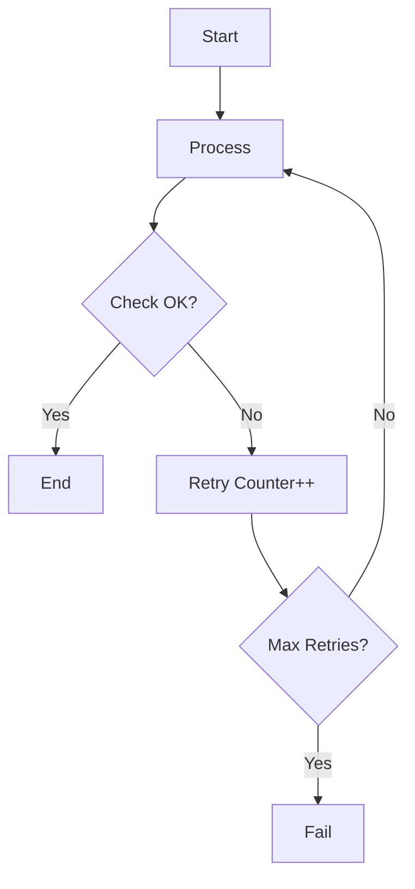

**Solution**: Add an explicit counter/guard to bound the retry logic.

**Config**:
```json
{
  "rules": {
    "no-cycles": {
      "allow-self-loop": false
    }
  }
}
```

### ✅ After (Fixed - Option 2: Allow Self-Loop)

If self-loops are acceptable (e.g., for representing retry logic):

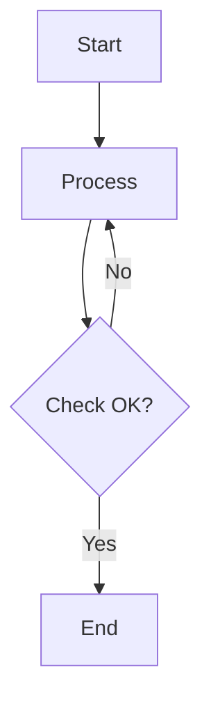

**Config to allow self-loops**:
```json
{
  "rules": {
    "no-cycles": {
      "allow-self-loop": true
    }
  }
}
```

---

## no-disconnected-nodes

**Purpose**: Ensures all nodes are reachable from the start node (no orphaned nodes).

⚠️ **Violation**: One or more nodes are unreachable, indicating incomplete diagrams or unused elements.

### ❌ Before (Violation)

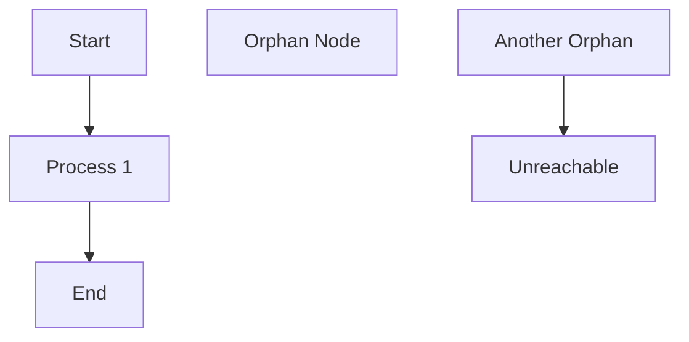

**Issue**: Nodes `D`, `E`, and `F` are not reachable from the start node `A`.

**Config to trigger**:
```json
{
  "rules": {
    "no-disconnected-nodes": {
      "enabled": true,
      "severity": "error"
    }
  }
}
```

### ✅ After (Fixed)

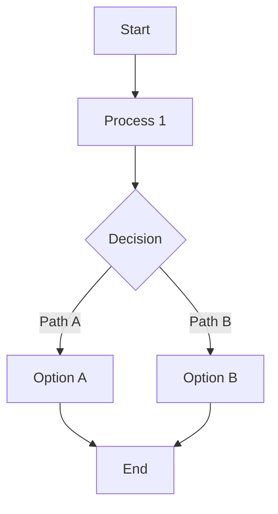

**Solution**: Connect orphaned nodes to the main flow by adding edges or decisions.

**Config**:
```json
{
  "rules": {
    "no-disconnected-nodes": {
      "enabled": true
    }
  }
}
```

**Or suppress if intentional** (e.g., documentation diagram):
```json
{
  "rules": {
    "no-disconnected-nodes": {
      "suppression-selectors": ["node:D", "node:E", "node:F"]
    }
  }
}
```

---

## no-duplicate-node-ids

**Purpose**: Ensures all node identifiers are unique within the diagram.

⚠️ **Violation**: Two nodes share the same ID, causing ambiguity and parse errors.

### ❌ Before (Violation)

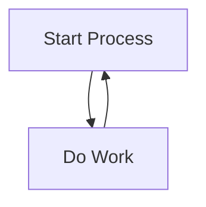

**Issue**: This is actually valid. Here's a real violation:

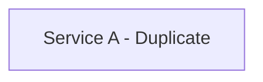

**Config to trigger**:
```json
{
  "rules": {
    "no-duplicate-node-ids": {
      "enabled": true,
      "severity": "error"
    }
  }
}
```

### ✅ After (Fixed)

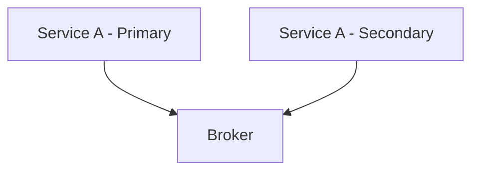

**Solution**: Rename duplicate IDs to be unique. Use suffixes or numbered variants.

**Config**:
```json
{
  "rules": {
    "no-duplicate-node-ids": {
      "enabled": true
    }
  }
}
```

**Suppression not recommended** (this is usually a real error):
```json
{
  "rules": {
    "no-duplicate-node-ids": {
      "suppression-selectors": ["node:A"]
    }
  }
}
```

---

## Testing Your Fixes

To verify a diagram passes all rules:

```bash
# Using the API
curl -X POST http://localhost:8080/v1/analyze \
  -H "Content-Type: application/json" \
  -d '{
    "code": "graph TD\n  A[Start] --> B[End]",
    "config": {
      "schema-version": "v1",
      "rules": {
        "max-fanout": {"limit": 5},
        "max-depth": {"limit": 8},
        "no-cycles": {"allow-self-loop": false},
        "no-disconnected-nodes": {},
        "no-duplicate-node-ids": {}
      }
    }
  }'
```

Expected success response:
```json
{
  "valid": true,
  "lint-supported": true,
  "issues": []
}
```

---

## Configuration Template

Use this as a starting point for your project:

```json
{
  "schema-version": "v1",
  "rules": {
    "max-fanout": {
      "enabled": true,
      "limit": 5,
      "severity": "warning",
      "suppression-selectors": []
    },
    "max-depth": {
      "enabled": true,
      "limit": 8,
      "severity": "warning",
      "suppression-selectors": []
    },
    "no-cycles": {
      "enabled": true,
      "allow-self-loop": false,
      "severity": "error",
      "suppression-selectors": []
    },
    "no-disconnected-nodes": {
      "enabled": true,
      "severity": "error",
      "suppression-selectors": []
    },
    "no-duplicate-node-ids": {
      "enabled": true,
      "severity": "error",
      "suppression-selectors": []
    }
  }
}
```

---

## See Also

- [Mermaid Syntax Reference](https://mermaid.js.org/intro/)
- [Configuration Guide](../config-examples.md)
- [Rule Suppressions Guide](./rule-suppressions.md)
