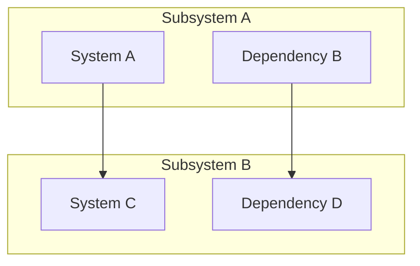
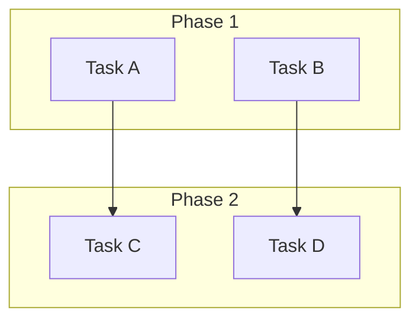
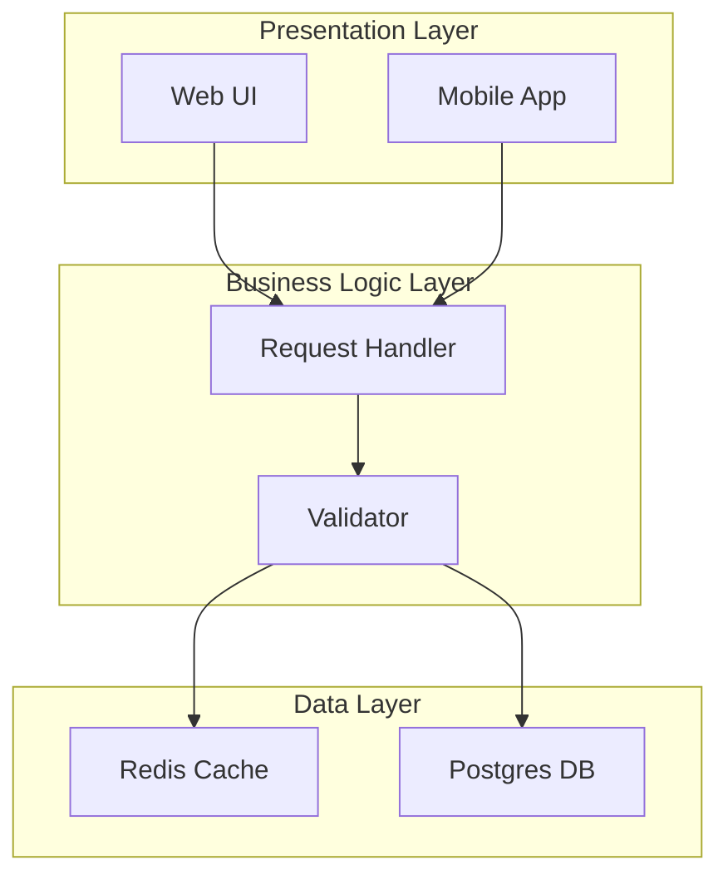
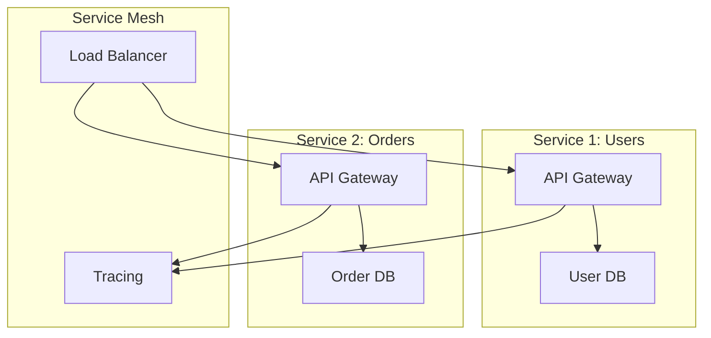
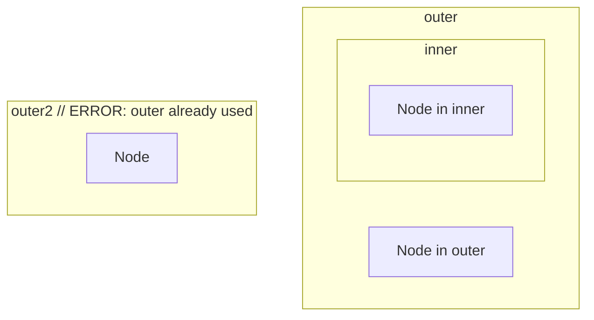

# Subgraph Namespaces and Node ID Uniqueness

This document clarifies how the `no-duplicate-node-ids` rule treats subgraphs and whether node IDs must be globally unique or only unique within their scope.

---

## The Rule: `no-duplicate-node-ids`

**Purpose**: Ensures all node identifiers are unique within a diagram (case-sensitive), preventing ID collisions that cause parse ambiguity.

**Severity**: Error (blocks diagram)

**Applies to**: Flowchart diagrams

---

## Key Principle: Global ID Uniqueness

⚠️ **In Mermaid (and merm8), node IDs must be globally unique across the entire diagram, including all subgraphs.**

Subgraph namespaces DO NOT create separate ID scopes. A node ID `A` cannot appear in both `subgraph cluster1` and `subgraph cluster2`.

Node identity is case-sensitive (`A` and `a` are distinct IDs).

---

## Examples

### ✅ Valid: Unique IDs Across Subgraphs



**Result**: All node IDs (`A`, `B`, `C`, `D`) are unique globally. ✅ Passes `no-duplicate-node-ids`.

**Metrics**:

```json
{
  "diagram-type": "flowchart",
  "node-count": 4,
  "duplicate-node-count": 0
}
```

---

### ❌ Invalid: Duplicate ID Across Subgraphs

```mermaid
graph TD
    subgraph cluster1 ["Subsystem A"]
        A[Service A]
        B[Broker]
    end

    subgraph cluster2 ["Subsystem B"]
        A[Service A]  ← DUPLICATE!
        C[Sink]
    end

    A --> B
    B --> C
```

**Result**: Node ID `A` is defined twice (once in each cluster). ❌ Fails `no-duplicate-node-ids`.

**Error Response** (HTTP 200 OK, but with issues):

```json
{
  "valid": true,
  "lint-supported": true,
  "issues": [
    {
      "rule-id": "no-duplicate-node-ids",
      "severity": "error",
      "message": "duplicate node ID: A",
      "line": 7
    }
  ],
  "metrics": {
    "duplicate-node-count": 1
  }
}
```

---

### ✅ Valid: Subgraph Names Don't Count as IDs

Subgraph **names** (e.g., `cluster1`, `cluster2`) are separate from node IDs. You can have multiple subgraphs with the same visual label without conflict:



**Result**: Subgraph IDs (`sg1`, `sg2`) are unique; node IDs (`A`, `B`, `C`, `D`) are unique. ✅ Passes.

**Note**: If you tried to use `subgraph A` twice, that's a duplicate subgraph ID, not a duplicate node ID. The parser rejects it.

---

## Why Global ID Uniqueness?

Mermaid's AST (Abstract Syntax Tree) represents all nodes in a flat map with ID as the key. Subgraphs are **grouping constructs** in the visual layout, not scoping constructs in the data model.

**Parser perspective**:

```javascript
// Internal representation (simplified)
{
  nodes: {
    "A": {id: "A", label: "Service A", parent: "cluster1"},
    "B": {id: "B", label: "Broker", parent: "cluster1"},
    "C": {id: "C", label: "Service C", parent: "cluster2"}
    // "A" again? ERROR: duplicate key
  },
  subgraphs: {
    "cluster1": {id: "cluster1", label: "Subsystem A", children: ["A", "B"]},
    "cluster2": {id: "cluster2", label: "Subsystem B", children: ["C"]}
  }
}
```

---

## Suppressing Duplicate Node ID Issues

If you absolutely must have (or test) duplicate IDs, you can suppress the rule:

```json
{
  "code": "...duplicate ID diagram...",
  "config": {
    "schema-version": "v1",
    "rules": {
      "no-duplicate-node-ids": {
        "suppression-selectors": ["node:A"] // Don't report duplicates of node A
      }
    }
  }
}
```

**Caution**: Suppressing this rule masks the real problem. The diagram may not render correctly or behave as expected.

---

## Common Misconceptions

### Misconception 1: "Subgraph clusters create separate ID namespaces"

**False**. IDs must be globally unique.

```mermaid
graph TD
    subgraph A ["System A"]
        B[Process]
    end

    subgraph A2 ["System A Copy"]  // Subgraph IDs can differ
        B[Process]  // Node ID B cannot be repeated anywhere
    end
```

This diagram has a **duplicate node ID** error, not because the subgraph IDs are similar, but because there are two nodes named `B`.

### Misconception 2: "I can use qualified IDs like cluster1.A"

**False**. Mermaid does not support qualified ID syntax. Dots are treated as part of the ID literal.

```mermaid
graph TD
    A[Node]
    cluster1.A[Node]  // This is a DIFFERENT ID: "cluster1.A" vs "A"
```

These are two distinct nodes with different IDs.

### Misconception 3: "Subgraph name A and node A can coexist"

**False**. Both subgraph IDs and node IDs share the same global namespace in the parser.

```mermaid
graph TD
    subgraph A ["Subsystem"]
        B[Task]
    end

    A[Node]  // ERROR: A is already a subgraph ID
```

---

## Testing Subgraph Behavior

Use the API to verify subgraph handling:

```bash
curl -X POST http://localhost:8080/v1/analyze \
  -H "Content-Type: application/json" \
  -d '{
    "code": "graph TD\nsubgraph sg1\nA[Node]\nend\nsubgraph sg2\nB[Node]\nend",
    "config": {
      "schema-version": "v1",
      "rules": {
        "no-duplicate-node-ids": {"enabled": true}
      }
    }
  }' | jq '.issues'

# Expected: [] (empty, no duplicates)

# Now with actual duplicate:
curl -X POST http://localhost:8080/v1/analyze \
  -H "Content-Type: application/json" \
  -d '{
    "code": "graph TD\nsubgraph sg1\nA[Node A]\nend\nsubgraph sg2\nA[Node A again]\nend",
    "config": {
      "schema-version": "v1",
      "rules": {
        "no-duplicate-node-ids": {"enabled": true}
      }
    }
  }' | jq '.issues'

# Expected: [{rule-id: "no-duplicate-node-ids", message: "duplicate node ID: A", ...}]
```

---

## Subgraph Examples: Correct Practices

### Example 1: Multi-Layer Architecture (Good)



**Key**: All IDs are unique globally:

- Subgraph IDs: `presentation`, `business`, `data`
- Node IDs: `UI`, `Mobile`, `Handler`, `Validator`, `Cache`, `DB`

No duplicates. ✅ Passes `no-duplicate-node-ids`.

---

### Example 2: Micro-Service Architecture (Good)



**Key**: Each service has distinct node IDs (`API1` vs `API2`, `DB1` vs `DB2`). Subgraph IDs are also distinct.

---

## FAQ

**Q: Can I have two subgraphs with the same display label?**

A: You _can_ visually have the same label (e.g., both say "Phase"), but the **subgraph IDs must be unique**:

```mermaid
graph TD
    subgraph phase1 ["Phase 1"]
        A[Setup]
    end

    subgraph phase2 ["Phase 1"]  // Same visual label
        B[Execute]
    end
```

Subgraph IDs (`phase1`, `phase2`) are unique. ✅

---

**Q: Does `no-duplicate-node-ids` apply to subgraph IDs too?**

A: Yes, implicitly. The rule checks all unique identifiers in the diagram, including subgraph IDs.

---

**Q: What if I have deeply nested subgraphs?**

A: All nodes and subgraph IDs must still be globally unique, regardless of nesting depth.



---

## See Also

- [Rule Fix Examples: no-duplicate-node-ids](./examples/rule-fixes.md#no-duplicate-node-ids)
- [Rule Suppression Guide](./examples/rule-suppressions.md)
- [Mermaid Subgraph Docs](https://mermaid.js.org/syntax/flowchart.html#subgraphs)
